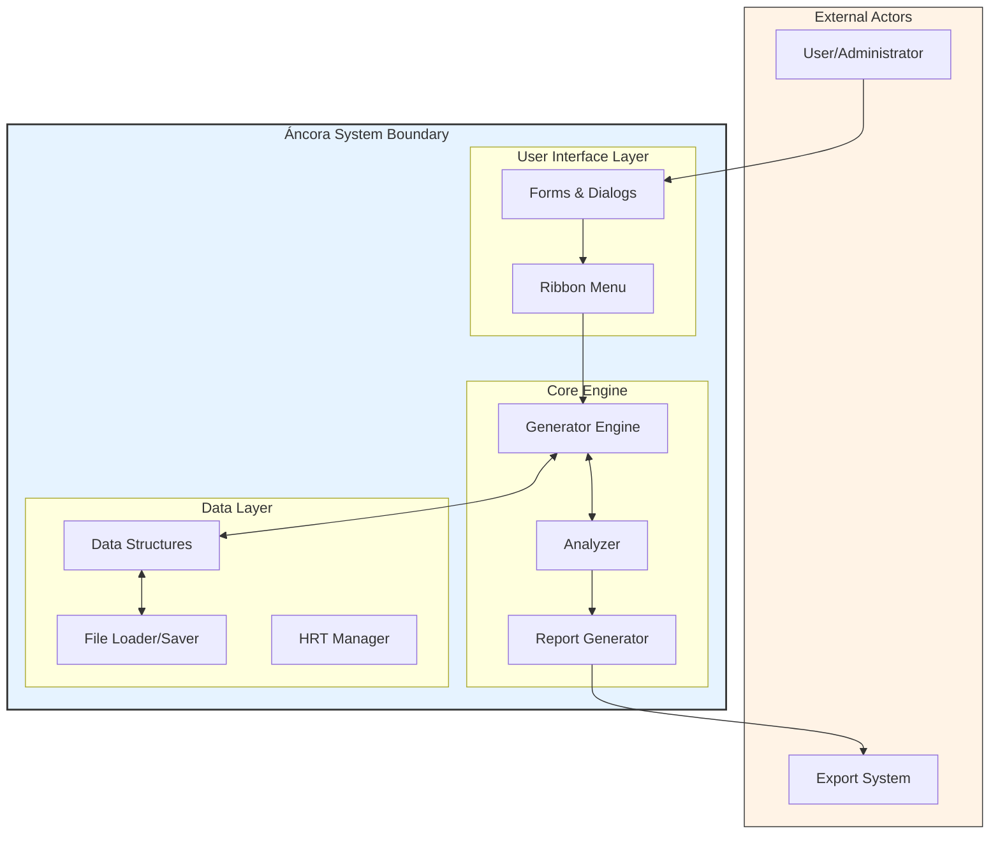
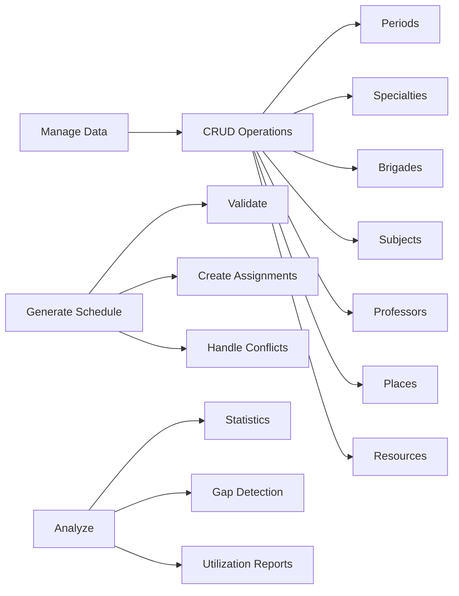
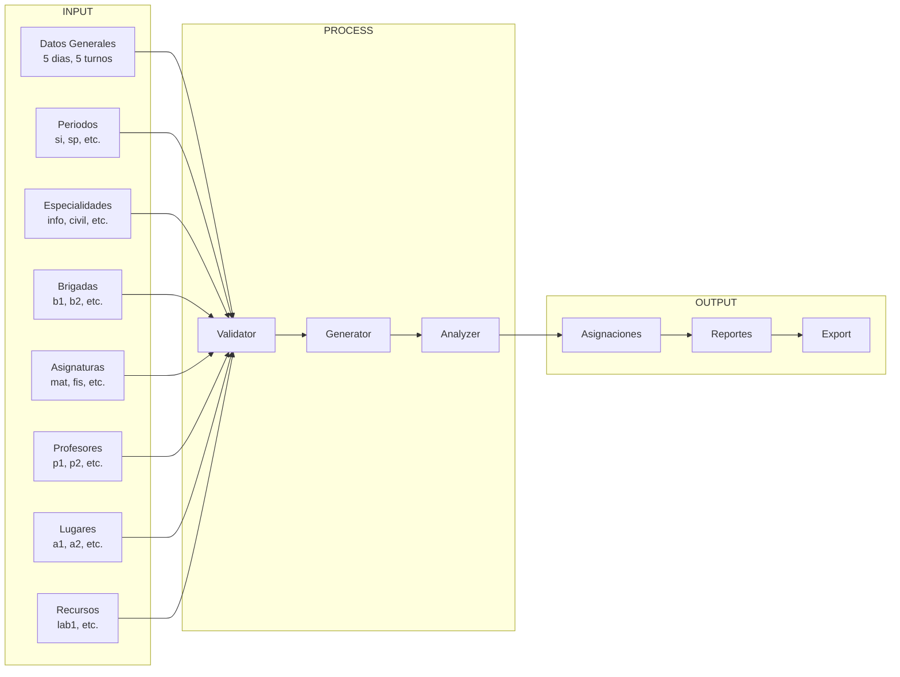
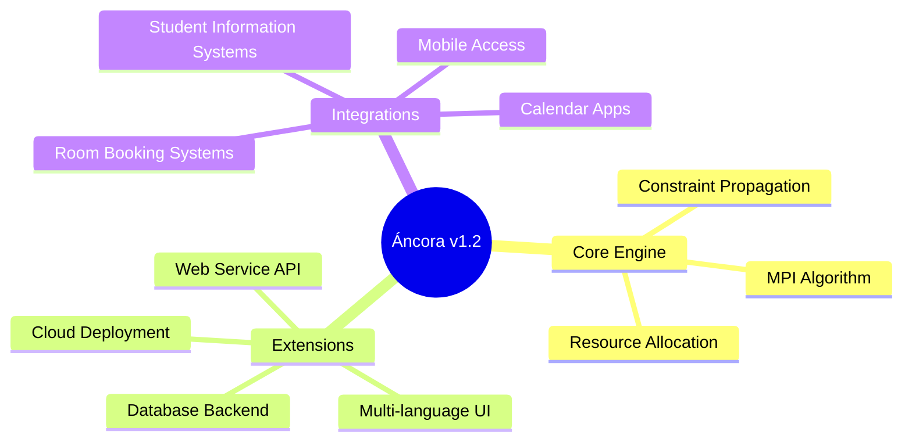

# 01. Context Model (Modelo de Contexto)

## 1.1 System Purpose

**Áncora** is an automatic scheduling system designed to generate and manage academic timetables for educational institutions.

### Mission Statement
> Automate the creation of conflict-free academic schedules by intelligently assigning activities to time slots while respecting physical, temporal, and human constraints.

---

## 1.2 System Scope

---

## 1.3 External Entities (Actors)

### Primary Actors

| Actor | Description | Role |
|-------|-------------|------|
| **Schedule Administrator** | Manages data entry and system configuration | Primary user |
| **Academic Coordinator** | Reviews and adjusts generated schedules | Secondary user |
| **Export System** | Receives schedule data for external use | Automated consumer |

### Use Case Summary

---

## 1.4 Data Flow Overview

---

## 1.5 System Boundaries

### What Áncora DOES:
- ✅ Generate conflict-free schedules
- ✅ Manage complex multi-entity relationships
- ✅ Handle resource constraints
- ✅ Analyze schedule quality
- ✅ Export to multiple formats

### What Áncora DOES NOT:
- ❌ Manage student enrollment
- ❌ Handle billing/payments
- ❌ Provide course registration
- ❌ Integrate with SIS/SMS directly

---

## 1.6 Key Metrics

| Metric | Value |
|--------|-------|
| Maximum Days (MAX_DIAS) | 7 |
| Maximum Periods (MAX_TURNOS) | 12 |
| Maximum Activities per Period (MAX_ACT) | 5 |
| Entity Types | 9 |

---

## 1.7 Future Context Considerations

---

*Document Status: 🔄 In Progress*
*Next: Move to Business Model (02-Negocio)*
