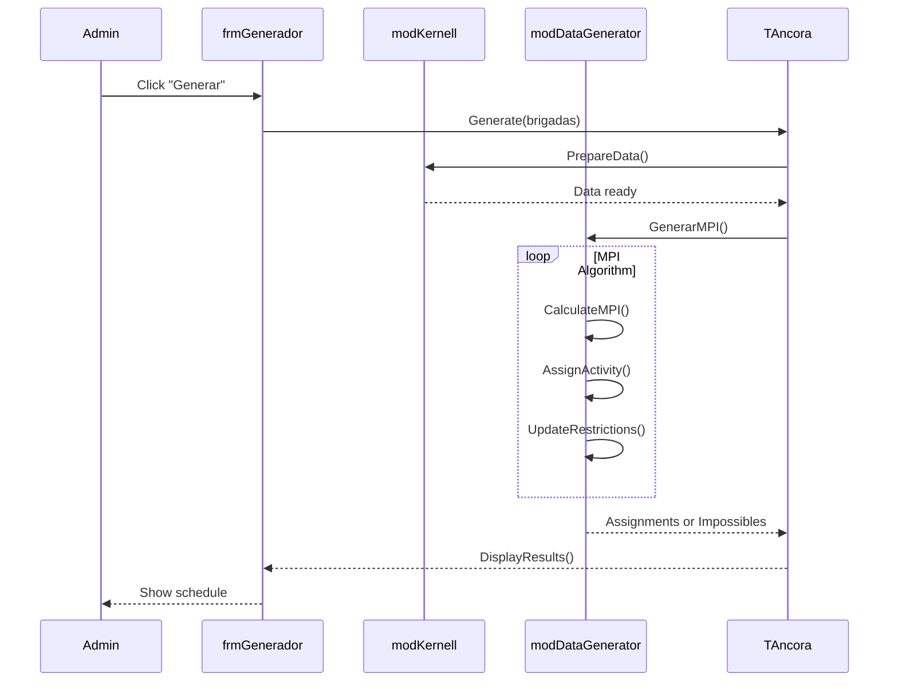

# Use Cases

> User interactions with the Áncora system.

## Actor Definitions

| Actor | Description | Type |
|-------|-------------|------|
| **Administrador** | Schedule Administrator | Primary |
| **Coordinador** | Academic Coordinator | Secondary |
| **Sistema Exportación** | Export System | Automated |
| **Profesor** | Professor | Secondary |

## Use Case Diagram

```mermaid
graph TB
    subgraph "Gestión de Datos"
        UC1[Crear Período]
        UC2[Crear Especialidad]
        UC3[Crear Brigada]
        UC4[Crear Asignatura]
        UC5[Crear Profesor]
        UC6[Crear Lugar]
        UC7[Crear Recurso]
    end
    
    subgraph "Programación"
        UC10[Generar Horario]
        UC11[Asignar Manualmente]
        UC12[Marcar como Fija]
        UC13[Redistribuir]
    end
    
    subgraph "Análisis"
        UC20[Ver Estadísticas]
        UC21[Detectar Conflictos]
        UC22[Ver Distribución]
    end
    
    subgraph "Exportación"
        UC30[Exportar HTML]
        UC31[Exportar a Excel]
        UC32[Duplicar Escenario]
    end
    
    Admin([Administrador]) --> UC1
    Admin --> UC3
    Admin --> UC5
    Admin --> UC10
    Admin --> UC20
    Admin --> UC30
    
    Coord([Coordinador]) --> UC11
    Coord --> UC12
    Coord --> UC21
    Coord --> UC22
    
    Export([Sistema]) --> UC30
```

## Use Case Details

### UC1: Crear Período

| Field | Value |
|-------|-------|
| ID | UC-001 |
| Actor | Administrador |
| Preconditions | Archivo abierto |
| Postconditions | Nuevo período disponible |
| Main Flow | 1. Abrir diálogo de período 2. Ingresar nombre (ej: "2024-1") 3. Definir días y turnos 4. Confirmar creación |
| Exceptions | Nombre duplicado → mostrar error |

---

### UC2: Crear Especialidad

| Field | Value |
|-------|-------|
| ID | UC-002 |
| Actor | Administrador |
| Preconditions | Archivo abierto |
| Postconditions | Nueva especialidad en sistema |
| Main Flow | 1. Abrir formulario de especialidad 2. Ingresar ID y descripción 3. Definir restricciones HRT 4. Guardar |

---

### UC3: Crear Brigada

| Field | Value |
|-------|-------|
| ID | UC-003 |
| Actor | Administrador |
| Preconditions | Especialidad existe |
| Postconditions | Nueva brigada asociada a especialidad |
| Main Flow | 1. Seleccionar especialidad 2. Crear brigada (ej: "1A", "2B") 3. Definir matrícula 4. Asignar a clasificaciones 5. Guardar |

---

### UC4: Crear Asignatura

| Field | Value |
|-------|-------|
| ID | UC-004 |
| Actor | Administrador |
| Preconditions | Especialidad existe |
| Postconditions | Nueva asignatura con desglose |
| Main Flow | 1. Seleccionar especialidad 2. Crear asignatura 3. Definir desglose (actividades) 4. Asignar profesores y lugares 5. Guardar |

---

### UC5: Crear Profesor

| Field | Value |
|-------|-------|
| ID | UC-005 |
| Actor | Administrador |
| Preconditions | Archivo abierto |
| Postconditions | Nuevo profesor disponible |
| Main Flow | 1. Abrir formulario de profesor 2. Ingresar ID y nombre 3. Definir disponibilidad 4. Asignar a asignaturas 5. Guardar |

---

### UC6: Crear Lugar

| Field | Value |
|-------|-------|
| ID | UC-006 |
| Actor | Administrador |
| Preconditions | Archivo abierto |
| Postconditions | Nuevo lugar disponible |
| Main Flow | 1. Abrir formulario de lugar 2. Ingresar ID y descripción 3. Definir capacidad 4. Establecer restricciones 5. Guardar |

---

### UC7: Crear Recurso

| Field | Value |
|-------|-------|
| ID | UC-007 |
| Actor | Administrador |
| Preconditions | Archivo abierto |
| Postconditions | Nuevo recurso disponible |
| Main Flow | 1. Abrir formulario de recurso 2. Ingresar ID y descripción 3. Definir tipo (virtual/físico) 4. Establecer disponibilidad 5. Guardar |

---

### UC10: Generar Horario

| Field | Value |
|-------|-------|
| ID | UC-010 |
| Actor | Administrador |
| Preconditions | Datos cargados, entidades definidas |
| Postconditions | Horario generado o imposible |
| Main Flow | 1. Seleccionar período destino 2. Elegir brigadas a programar 3. Ejecutar generación MPI 4. Revisar resultados 5. Guardar horario |
| Exceptions | Asignación imposible →报告显示 |

---

### UC11: Asignar Manualmente

| Field | Value |
|-------|-------|
| ID | UC-011 |
| Actor | Coordinador |
| Preconditions | Horario existente |
| Postconditions | Asignación modificada |
| Main Flow | 1. Seleccionar celda vacía 2. Elegir asignatura/actividad 3. Seleccionar profesor y lugar 4. Confirmar asignación |

---

### UC12: Marcar como Fija

| Field | Value |
|-------|-------|
| ID | UC-012 |
| Actor | Coordinador |
| Preconditions | Asignación existe |
| Postconditions | Asignación no se mueve en regeneración |
| Main Flow | 1. Seleccionar asignación 2. Marcar checkbox "fija" 3. Confirmar |

---

### UC13: Redistribuir

| Field | Value |
|-------|-------|
| ID | UC-013 |
| Actor | Administrador |
| Preconditions | Horario existente |
| Postconditions | Actividades redistribuidas |
| Main Flow | 1. Seleccionar brigadas 2. Ejecutar redistribución 3. Revisar cambios |

---

### UC20: Ver Estadísticas

| Field | Value |
|-------|-------|
| ID | UC-020 |
| Actor | Administrador, Coordinador |
| Preconditions | Horario generado |
| Postconditions | Ninguna (solo lectura) |
| Main Flow | 1. Abrir panel de estadísticas 2. Ver cobertura, conflictos 3. Analizar utilización |

---

### UC21: Detectar Conflictos

| Field | Value |
|-------|-------|
| ID | UC-021 |
| Actor | Coordinador |
| Preconditions | Horario existente |
| Postconditions | Ninguna (solo lectura) |
| Main Flow | 1. Ejecutar análisis 2. Ver lista de conflictos 3. Navegar a cada conflicto |

---

### UC22: Ver Distribución

| Field | Value |
|-------|-------|
| ID | UC-022 |
| Actor | Coordinador |
| Preconditions | Horario existente |
| Postconditions | Ninguna (solo lectura) |
| Main Flow | 1. Seleccionar vista de distribución 2. Ver gráfico de carga 3. Identificar huecos |

---

### UC30: Exportar HTML

| Field | Value |
|-------|-------|
| ID | UC-030 |
| Actor | Administrador |
| Preconditions | Horario generado |
| Postconditions | Archivos HTML en directorio |
| Main Flow | 1. Seleccionar exportar HTML 2. Elegir brigadas a exportar 3. Definir directorio destino 4. Generar archivos 5. Abrir en navegador |

---

### UC31: Exportar a Excel

| Field | Value |
|-------|-------|
| ID | UC-031 |
| Actor | Administrador |
| Preconditions | Horario generado |
| Postconditions | Archivo Excel generado |
| Main Flow | 1. Seleccionar exportar Excel 2. Elegir contenido 3. Generar libro 4. Abrir o guardar |

---

### UC32: Duplicar Escenario

| Field | Value |
|-------|-------|
| ID | UC-032 |
| Actor | Administrador |
| Preconditions | Archivo abierto |
| Postconditions | Nuevo escenario idéntico |
| Main Flow | 1. Seleccionar duplicar 2. Ingresar nuevo nombre 3. Confirmar 4. Trabajar con copia |

---

## Sequence Examples

### Generar Horario (UC10)

---

*Document Status: 🔄 In Progress*
*Next: Add error scenarios and alternative flows*
