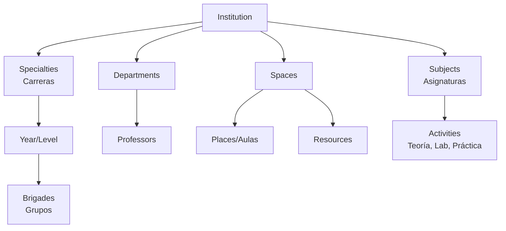
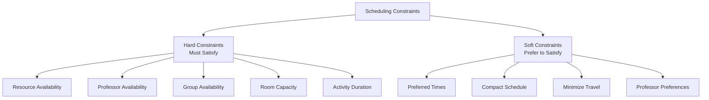
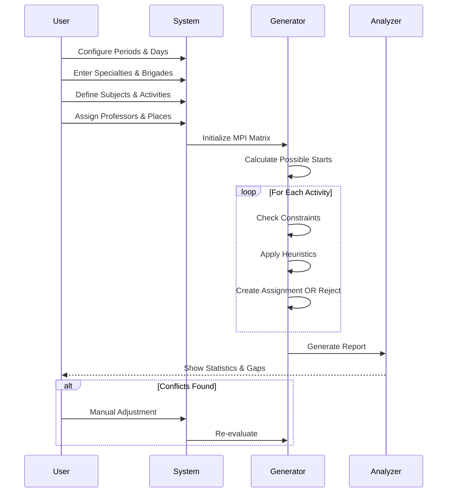
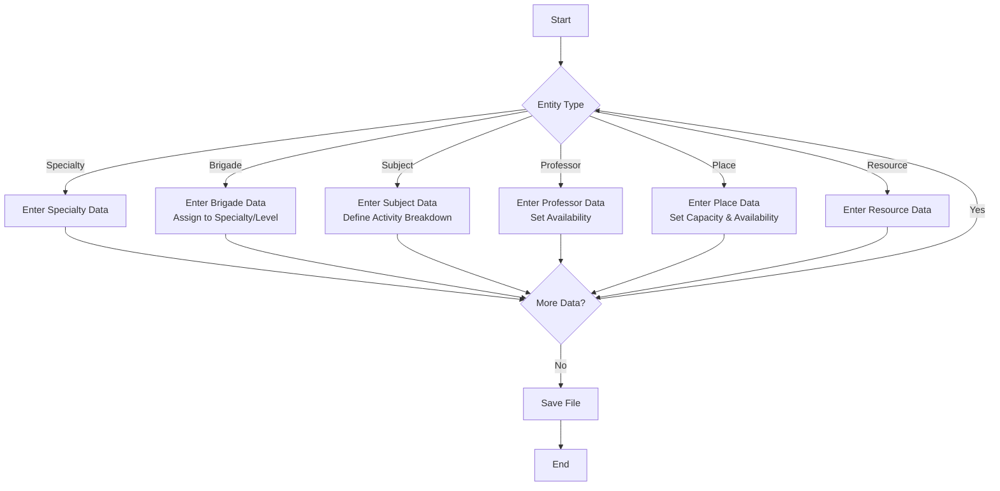
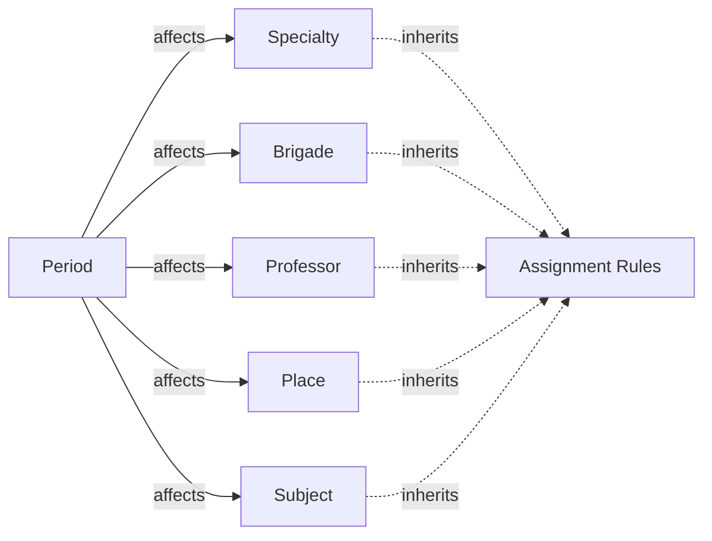

# 02. Business Model (Modelo de Negocio)

## 2.1 Business Domain

Áncora operates in the **Educational Scheduling** domain, addressing the NP-hard problem of assigning educational activities to time slots under multiple constraints.

---

## 2.2 Core Business Concepts

### 2.2.1 Educational Institution Structure



### 2.2.2 Key Entities

| Entity | Spanish | English | Purpose |
|--------|---------|---------|---------|
| Especialidad | Specialty | Academic program (e.g., Engineering) |
| Brigada | Brigade | Student group with shared schedule |
| Asignatura | Subject | Course containing activities |
| Clasificación | Classification | Activity type (theory, lab, practice) |
| Profesor | Professor | Instructor with availability |
| Lugar | Place | Physical space (classroom) |
| Período | Period | Time block (day × time slot) |
| Recurso | Resource | Equipment/facility needed |

---

## 2.3 Business Rules

### 2.3.1 Constraint Hierarchy



### 2.3.2 Hard Constraints

1. **No Overlap**: A professor cannot teach two activities at the same time
2. **Room Occupancy**: A room cannot host two activities simultaneously
3. **Group Availability**: A brigade cannot attend two different activities at once
4. **Capacity**: Room capacity must meet or exceed group size
5. **Duration**: Activities requiring multiple consecutive slots must be placed contiguously

### 2.3.3 Soft Constraints (Optimization Goals)

1. **ZPriori (Zone Priority)**: Prefer certain time zones for certain activity types
2. **Continuity**: Theory and practice ideally on the same day
3. **Distance**: Minimize travel between rooms
4. **Load Balance**: Distribute teaching load evenly among professors

---

## 2.4 Business Processes

### 2.4.1 Schedule Generation Workflow



### 2.4.2 Data Entry Flow



---

## 2.5 Business Rules Specification

### 2.5.1 Assignment Rules

```
RULE: No Concurrent Assignment
  IF professor P assigned to activity A at (day D, slot S)
  THEN no other activity can use P at (D, S)

RULE: Capacity Check
  IF brigade B has size N
  AND place P has capacity C
  THEN C >= N is required

RULE: Activity Duration
  IF activity type T requires CT slots
  THEN place assignment must have CT consecutive free slots
```

### 2.5.2 Classification Rules

| Classification Property | Description |
|------------------------|-------------|
| `ct` | Consecutive slots required |
| `continuos` | Must be same day |
| `zpriori` | Zone priority matrix |

---

## 2.6 HRT (Herencia de Restricciones de Tiempo)

The **HRT** system allows constraints to be inherited between entities:



### HRT Entity Types

| From (A) | To (B) | Inheritance Type |
|----------|---------|-----------------|
| Period | Specialty | Time availability |
| Period | Brigade | Schedule windows |
| Period | Professor | Working hours |
| Period | Place | Operating hours |
| Period | Resource | Availability |
| Period | Classification | Preferred zones |

---

## 2.7 Business Metrics

| Metric | Spanish | Calculation |
|--------|---------|------------|
| Coverage | Cobertura | Assigned / Total Activities |
| Conflicts | Conflictos | Overlapping assignments |
| Utilization | Utilización | Slots used / Total slots |
| Gap Ratio | Huecos | Empty slots per entity |

---

## 2.8 Flexibility Design

Áncora is designed for **universality** through:

1. **Parametric Constraints**: All constraints are data-driven, not hard-coded
2. **Entity Relationships**: Flexible linking between entities
3. **No Business Logic**: Based on physical reality, not specific rules
4. **Generic Algorithms**: MPI works with any entity configuration

---

*Document Status: 🔄 In Progress*
*Next: Logical Model (03-Logico)*
