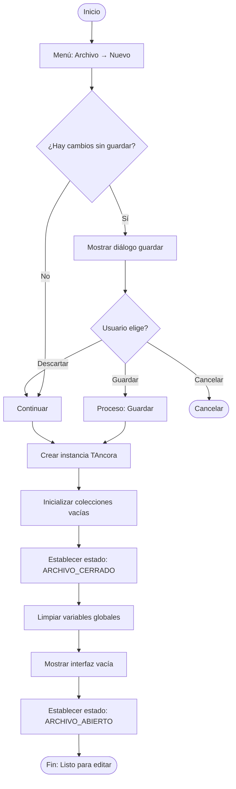
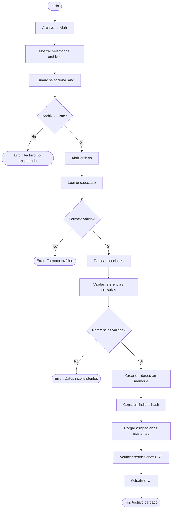
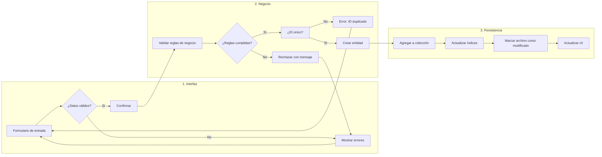
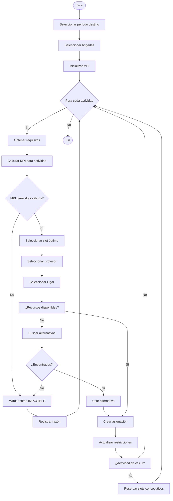
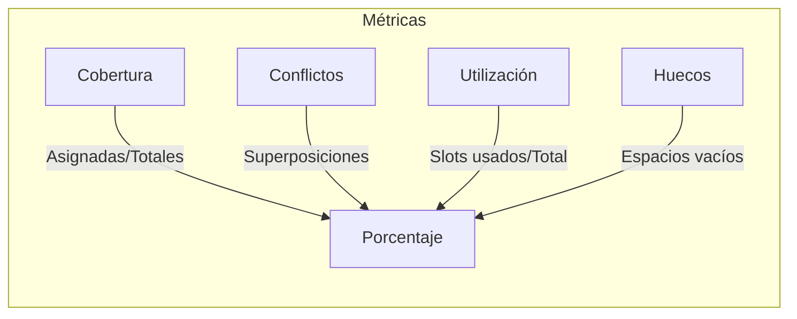
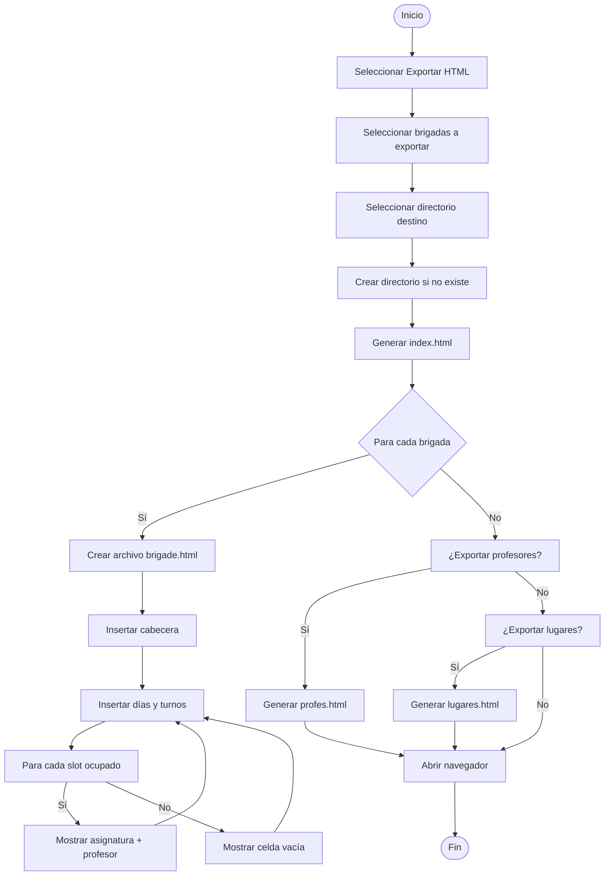
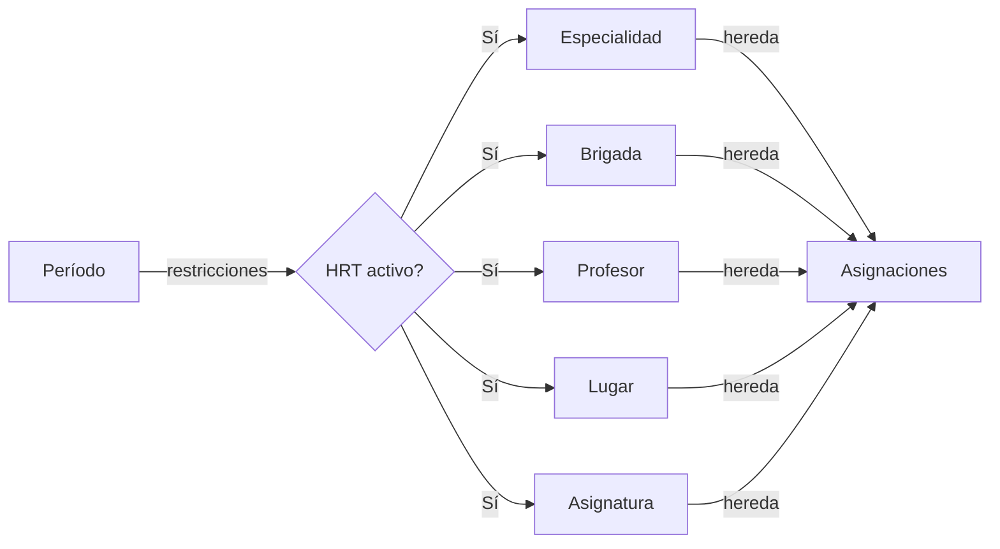

# Process Flows (Flujos de Procesos)

> Detailed business process workflows for Áncora scheduling system.

---

## P1: Crear Archivo Nuevo

```
┌─────────────────────────────────────────────────────────────────────┐
│ PROCESO: Crear Archivo de Horarios                                  │
├─────────────────────────────────────────────────────────────────────┤
│ OBJETIVO: Inicializar un nuevo archivo .anc con estructura vacía   │
│ ACTOR: Administrador                                                │
│ PRECONDICIÓN: Ninguna                                               │
│ POSTCONDICIÓN: Archivo .anc creado con encabezado válido             │
└─────────────────────────────────────────────────────────────────────┘
```

### Diagrama de Flujo



### Detalle de Pasos

| Paso | Acción | Responsable | Sistema |
|------|--------|-------------|---------|
| 1 | Seleccionar menú Archivo → Nuevo | Usuario | - |
| 2 | Verificar estado actual | - | kernel |
| 3 | Confirmar si hay cambios pendientes | - | UI |
| 4 | Inicializar nuevo archivo | - | TAncora |
| 5 | Mostrar interfaz vacía | - | Forms |
| 6 | Listo para edición | - | - |

---

## P2: Cargar Datos desde Archivo

```
┌─────────────────────────────────────────────────────────────────────┐
│ PROCESO: Cargar Archivo .anc                                        │
├─────────────────────────────────────────────────────────────────────┤
│ OBJETIVO: Leer y validar un archivo .anc existente                  │
│ ACTOR: Administrador                                                │
│ PRECONDICIÓN: Archivo existe en disco                               │
│ POSTCONDICIÓN: Datos cargados en memoria, UI actualizada           │
└─────────────────────────────────────────────────────────────────────┘
```

### Diagrama de Flujo



### Validaciones

| Validación | Descripción |
|------------|-------------|
| `V001` | Encabezado presente con `app_name=Áncora` |
| `V002` | Versión compatible (1.0.0 - 1.2.0) |
| `V003` | Secciones requeridas presentes |
| `V004` | Campos obligatorios no vacíos |
| `V005` | IDs únicos dentro de cada entidad |
| `V006` | Referencias foráneas válidas |
| `V007` | Matrices de restricción consistentes |

---

## P3: Crear Entidad (Especialidad/Brigada/Asignatura/etc.)

```
┌─────────────────────────────────────────────────────────────────────┐
│ PROCESO: Crear Nueva Entidad                                        │
├─────────────────────────────────────────────────────────────────────┤
│ OBJETIVO: Agregar nueva entidad al sistema                          │
│ ACTOR: Administrador                                                │
│ VARIANTES: Especialidad, Brigada, Asignatura, Profesor, Lugar,      │
│            Recurso, Clasificación, Período                           │
└─────────────────────────────────────────────────────────────────────┘
```

### Flujo Genérico



### Reglas por Entidad

#### Especialidad
- ID no puede repetirse
- Descripción obligatoria
- Puede tener brigadas y asignaturas asociadas

#### Brigada
- Debe pertenecer a una especialidad existente
- Nivel debe ser numérico (> 0)
- Matrícula debe ser >= cantidad de grupos

#### Asignatura
- Debe pertenecer a una especialidad
- Debe tener al menos un desglose
- Desglose debe tener actividades con clasificación válida

---

## P4: Generar Horario (MPI)

```
┌─────────────────────────────────────────────────────────────────────┐
│ PROCESO: Generar Horario Automático                                 │
├─────────────────────────────────────────────────────────────────────┤
│ OBJETIVO: Crear asignaciones para todas las actividades posibles    │
│ ACTOR: Administrador                                                │
│ PRECONDICIÓN: Datos cargados, entidades definidas                   │
│ POSTCONDICIÓN: Horario generado o lista de imposibles               │
└─────────────────────────────────────────────────────────────────────┘
```

### Algoritmo Principal



### Funciones Clave

| Función | Descripción | Retorna |
|---------|-------------|---------|
| `PosibleInicio()` | Verifica si slot es válido | `TMPI_Casilla` |
| `AND_MPI()` | Combina MPI para múltiples brigadas | `TMPI1` |
| `OR_MPI()` | Combina MPI con alternativas | `TMPI1` |
| `FiltraProfexAct()` | Filtra profesores válidos | `TFiltro` |
| `FiltraLugxAct()` | Filtra lugares válidos | `TFiltro` |
| `AsignaActividad()` | Crea asignación real | `Boolean` |

---

## P5: Análisis de Horario

```
┌─────────────────────────────────────────────────────────────────────┐
│ PROCESO: Analizar Horario Generado                                  │
├─────────────────────────────────────────────────────────────────────┤
│ OBJETIVO: Calcular métricas y detectar problemas                     │
│ ACTOR: Administrador/Coordinador                                     │
│ PRECONDICIÓN: Horario generado                                      │
│ POSTCONDICIÓN: Reporte con estadísticas                             │
└─────────────────────────────────────────────────────────────────────┘
```

### Métricas Calculadas



| Métrica | Fórmula | Valor Ideal |
|---------|---------|-------------|
| **Cobertura** | `asignadas / total` | 100% |
| **Conflictos** | `superposiciones` | 0 |
| **Utilización Lugares** | `slots_usados / capacidad_total` | 70-85% |
| **Huecos por Brigada** | `slots_vacíos` | Mínimo |
| **Huecos por Profesor** | `slots_vacíos` | Mínimo |

---

## P6: Exportar a HTML

```
┌─────────────────────────────────────────────────────────────────────┐
│ PROCESO: Exportar Horario a HTML                                    │
├─────────────────────────────────────────────────────────────────────┤
│ OBJETIVO: Generar páginas web estáticas del horario                  │
│ ACTOR: Administrador                                                │
│ PRECONDICIÓN: Horario generado                                      │
│ POSTCONDICIÓN: Archivos HTML en directorio                          │
└─────────────────────────────────────────────────────────────────────┘
```

### Diagrama de Flujo



---

## P7: Mantenimiento de HRT

```
┌─────────────────────────────────────────────────────────────────────┐
│ PROCESO: Gestión de Herencia de Restricciones en Tiempo            │
├─────────────────────────────────────────────────────────────────────┤
│ OBJETIVO: Configurar propagación de restricciones entre entidades   │
│ ACTOR: Administrador                                                │
│ DESCRIPCIÓN: Las restricciones de Período se heredan a entidades    │
└─────────────────────────────────────────────────────────────────────┘
```

### Flujo de Herencia



### Casos de Uso HRT

| Caso | Descripción |
|------|-------------|
| **Excepción** | Período no aplica a cierta entidad |
| **Bloqueo** | Entidad no disponible en ciertos slots |
| **Preferencia** | Entidad prefiere ciertos horarios |

---

## P8: Reparación de Conflictos

```
┌─────────────────────────────────────────────────────────────────────┐
│ PROCESO: Reparar Conflictos Detectados                              │
├─────────────────────────────────────────────────────────────────────┤
│ OBJETIVO: Resolver superposiciones y violaciones de reglas         │
│ ACTOR: Administrador                                                │
│ PRECONDICIÓN: Análisis completado con conflictos                   │
│ POSTCONDICIÓN: Conflictos resueltos o documentados                 │
└─────────────────────────────────────────────────────────────────────┘
```

### Tipos de Conflictos

| Código | Tipo | Descripción | Solución Manual |
|--------|------|-------------|-----------------|
| `C001` | Superposición Profesor | Profesor en dos lugares | Mover una |
| `C002` | Superposición Lugar | Dos actividades mismo lugar | Mover una |
| `C003` | Superposición Brigada | Brigada en dos lugares | Mover una |
| `C004` | Capacidad Excedida | Lugar muy pequeño | Cambiar lugar |
| `C005` | Restricción Violada | Actividad en slot bloqueado | Mover o desbloquear |

---

## Glosario de Procesos

| Símbolo | Significado |
|---------|-------------|
| `→` | Flujo normal |
| `→|` | Decisión (Sí) |
| `→|` | Decisión (No) |
| `([ ])` | Inicio/Fin |
| `{ }` | Decisión |
| `---` | Conector |

---

*Document Status: 🟢 Complete*
*Last Updated: 2026-04-06*
