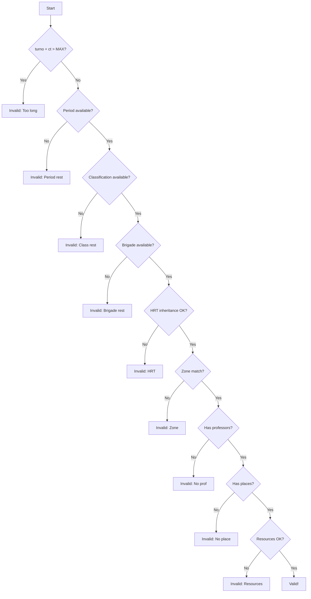

# Algorithm Documentation

> Overview of all algorithms used in the Áncora scheduling system.

---

## Algorithm Inventory

| ID | Algorithm | Category | Complexity | Location |
|----|-----------|----------|------------|----------|
| A1 | **MPI** | Constraint Propagation | O(n×d×t) | modDataGenerator |
| A2 | **AND_MPI** | Set Operations | O(b×d×t) | modDataGenerator |
| A3 | **OR_MPI** | Set Operations | O(d×t) | modDataGenerator |
| A4 | **SelectLugarOptimo** | Heuristic | O(p×g) | modDataGenerator |
| A5 | **PosibleInicio** | Constraint Checking | O(ct) | modDataGenerator |
| A6 | **Hash Indexing** | Search | O(1) | clsKernel |
| A7 | **HRT Propagation** | Inheritance | O(n) | TAncora |
| A8 | **Topological Sort** | Scheduling | O(v+e) | modDataRepair |

---

## A1: MPI - Matriz de Posibles Inicios

### Purpose
Calculate valid starting positions for scheduling an activity.

### Algorithm

```vb
Function PosibleInicio(per, dia, turno, asg, act, brg, zona) As TMPI_Casilla
    ' 1. Get activity requirements
    ct = Clasif(classification).ct
    if turno + ct - 1 > MAX_TURNOS then return invalid
    
    ' 2. Check all slots in activity duration
    for k = 1 to ct
        if not checkSlot(dia, turno + k - 1) then return invalid
    end
    
    ' 3. Filter available professors
    professors = FiltraProfexAct(per, asg, act, grupo)
    professors = FiltraProfeQuePermanece(professors, dia, turno, ct)
    
    ' 4. Filter available places
    places = FiltraLugxAct(per, asg, act)
    places = FiltraLugarQuePermanece(places, dia, turno, ct)
    places = QuitaSegunProhibidos(places, clasif, grupo)
    
    ' 5. Check resources
    resources = getFreeRecursos(...)
    
    ' 6. Return result
    if professors.cant > 0 and places.cant > 0 and resources.available
        return valid with lists
    else
        return invalid with reason
```

### Complexity
- **Time**: O(ct) for each slot check, plus filtering = O(n×ct)
- **Space**: O(p + pr) for professor and place lists

### Constraint Checks
1. Period availability
2. Classification restrictions
3. Brigade availability
4. HRT inheritance
5. Zone priority (zpriori)

---

## A2: AND_MPI - Intersection for Multiple Brigades

### Purpose
Find time slots where ALL brigades in a group can be scheduled.

### Algorithm

```vb
Function AND_MPI(brgs, per, asg, act, zona) As TMPI1
    ' Initialize result matrix
    result = empty TMPI1
    
    ' For each day and potential starting slot
    for day = 1 to MAX_DIAS
        for slot = 1 to MAX_TURNOS
            result.MPI(day, slot).valor = True
            
            ' AND with each brigade's availability
            for each brigade in brgs
                mpi = PosibleInicio(per, day, slot, asg, act, brigade, zona)
                
                ' Remove places that don't fit capacity
                mpi.lug = QuitaSegunCapacidad(brgs, mpi.lug)
                
                ' If any brigade can't do it, mark invalid
                if not mpi.valor then
                    result.MPI(day, slot).valor = False
                    exit inner loop
                end
            end
        end
    end
    
    return result
```

### Visualization

```
Brigade A MPI:     [✓][✓][✗][✓][✗][✗]
Brigade B MPI:     [✓][✗][✓][✓][✗][✗]
Brigade C MPI:     [✓][✗][✗][✓][✓][✗]
───────────────────────────────────────
AND_MPI Result:    [✓][✗][✗][✓][✗][✗]

Only slot 1 and 4 are valid for ALL brigades.
```

### Complexity
- **Time**: O(b × d × t × ct) where b=briades, d=days, t=turns
- **Space**: O(d × t) for result matrix

---

## A3: OR_MPI - Union for Alternative Options

### Purpose
Combine MPI matrices where ANY valid slot is acceptable.

### Algorithm

```vb
Function OR_MPI(mpi1, mpi2) As TMPI1
    for day = 1 to MAX_DIAS
        for slot = 1 to MAX_TURNOS
            ' Logical OR: valid if EITHER has valid slot
            result.MPI(day, slot).valor = mpi1.MPI(day, slot).valor OR mpi2.MPI(day, slot).valor
        end
    end
    return result
```

### Use Case
When multiple professors can teach an activity, combine their availability.

---

## A4: SelectLugarOptimo - Optimal Place Selection

### Purpose
Choose the best available classroom based on proximity and usage.

### Algorithm

```vb
Function SelectLugarOptimo(listaBrg, posibles, dia, per, turno, sentido) As Long
    ' 1. Get places used before/after this slot
    anteriores = SelectAnterioresSgtes(listaBrg, dia, per, turno, 1)  ' Before
    sgtes = SelectAnterioresSgtes(listaBrg, dia, per, turno, 2)      ' After
    
    ' 2. Try to reuse same place (continuity)
    for each lugar in posibles
        if lugar in anteriores or lugar in sgtes
            return lugar  ' Prefer continuity
        end
    end
    
    ' 3. Try adjacent places (proximity)
    masRepetido = MasSeRepite(anteriores or sgtes)
    if masRepetido in posibles
        return masRepetido
    end
    
    ' 4. Calculate distances and choose nearest
    minDistance = INFINITY
    bestPlace = posibles(1)
    
    for each lugar in posibles
        distance = Sum(Distance(lugar, anteriores)) + Sum(Distance(lugar, sgtes))
        if distance < minDistance
            minDistance = distance
            bestPlace = lugar
        end
    end
    
    return bestPlace
```

### Heuristic Weights
| Factor | Weight | Description |
|--------|--------|-------------|
| Same place | 0 | Perfect if available |
| Adjacent | 1 | Very good |
| Distance | Variable | Sum of all distances |

---

## A5: PosibleInicio - Constraint Verification

### Purpose
Verify if a specific slot can accommodate an activity.

### Constraint Checking Order



---

## A6: Hash Indexing

### Purpose
Provide O(1) lookup for entities by ID.

### Implementation


### Data Structure
```vb
' Hash tables for each entity type
Public hashPeriodos As TKernel_HashCollection
Public hashEspecialidades As TKernel_HashCollection
Public hashBrigadas As TKernel_HashCollection
Public hashProfesores As TKernel_HashCollection
Public hashLugares As TKernel_HashCollection
Public hashAsignaturas As TKernel_HashCollection
Public hashPxAct As TKernel_HashPxAct
```

### Operations
| Operation | Without Hash | With Hash |
|-----------|--------------|-----------|
| Insert | O(n) | O(1) |
| Find | O(n) | O(1) |
| Delete | O(n) | O(1) |
| Update | O(n) | O(1) |

---

## A7: HRT Propagation

### Purpose
Inherit time restrictions from Period to other entities.

### Algorithm

```vb
Function estaRestringidoPorHerencia(per, dia, turno, tipo, id, _
                                     Optional excepto As Boolean = True) As Boolean
    
    ' Get period restrictions for this day/slot
    periodoRest = getRestriccionPeriodo(per, dia, turno)
    
    if not periodoRest then return False  ' Period allows
    
    ' Check inheritance for each entity type
    select case tipo
        case dESPECIALIDAD
            return herenciaEspecialidad(per, id, dia, turno)
        case dBRIGADA
            return herenciaBrigada(per, id, dia, turno)
        case dPROFE
            return herenciaProfesor(per, id, dia, turno)
        case dLUGAR
            return herenciaLugar(per, id, dia, turno)
        case dASIG
            return herenciaAsignatura(per, id, dia, turno)
    end select
End Function
```

### HRT Flow
```
Período (Period)
    ↓
    ├─→ Especialidad → affects all brigades/subjects
    ├─→ Brigada → affects assignments directly
    ├─→ Profesor → affects availability
    ├─→ Lugar → affects availability
    └─→ Asignatura → affects availability
```

---

## A8: Topological Sort (Conflict Resolution)

### Purpose
Order activities by dependency for repair operations.

### Algorithm

```vb
Function OrdenarActividades(asignaciones) As List
    ' Build dependency graph
    graph = BuildGraph(asignaciones)
    
    ' Calculate in-degrees
    inDegree = CalculateInDegrees(graph)
    
    ' Kahn's algorithm
    queue = nodes with inDegree = 0
    result = empty list
    
    while queue not empty
        node = queue.dequeue
        result.add(node)
        
        for each neighbor in graph[node]
            inDegree[neighbor]--
            if inDegree[neighbor] = 0
                queue.enqueue(neighbor)
            end
        end
    end
    
    if result.size != graph.size
        error "Cycle detected"
    end
    
    return result
End Function
```

### Application
Used in `modDataRepair` to reorder assignments when resolving conflicts.

---

## Performance Considerations

### Bottlenecks

| Area | Issue | Impact | Solution |
|------|-------|--------|----------|
| MPI Calculation | Repeated for each activity | O(n²) | Cache results |
| Hash Lookups | String comparisons | O(m) | Precompute hashes |
| HRT Check | Nested loops | O(n) | Index by period |
| Filter Operations | Linear scans | O(n) | Use bit arrays |

### Optimization Opportunities

1. **Memoization**: Cache MPI results per activity
2. **Bit Arrays**: Use bitset for restriction matrices
3. **Parallel Processing**: Check constraints concurrently
4. **Lazy Evaluation**: Only calculate visible MPI

---

## Appendix: Algorithm Complexity Reference

| Algorithm | Best | Average | Worst |
|-----------|------|---------|-------|
| PosibleInicio | O(1) | O(ct) | O(ct) |
| AND_MPI | O(b×d) | O(b×d×t) | O(b×d×t) |
| OR_MPI | O(d×t) | O(d×t) | O(d×t) |
| SelectLugarOptimo | O(1) | O(p) | O(p×g) |
| Hash Lookup | O(1) | O(1) | O(n) |
| HRT Check | O(1) | O(1) | O(n) |

---

*Document Status: 🟢 Complete*
*Last Updated: 2026-04-06*
