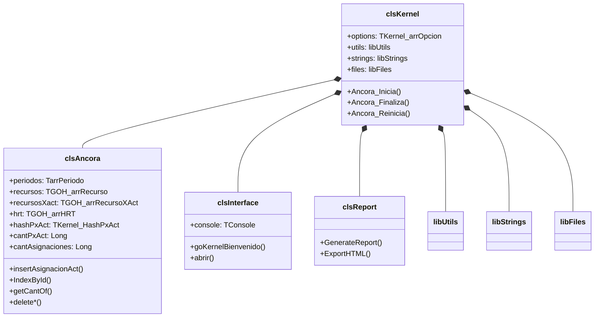
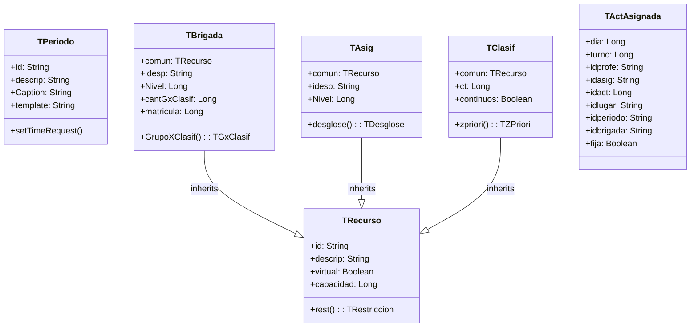
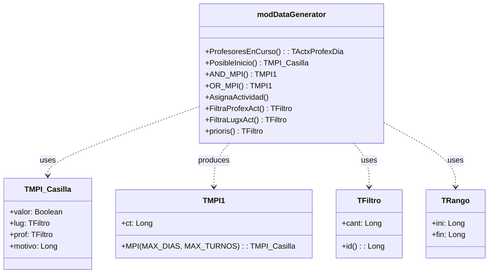
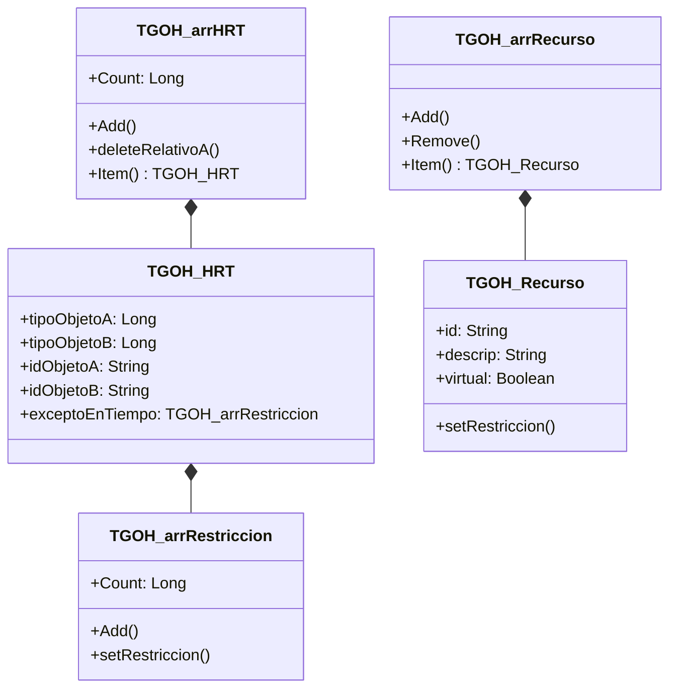
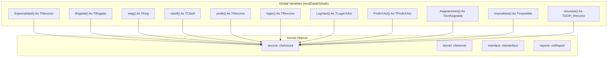
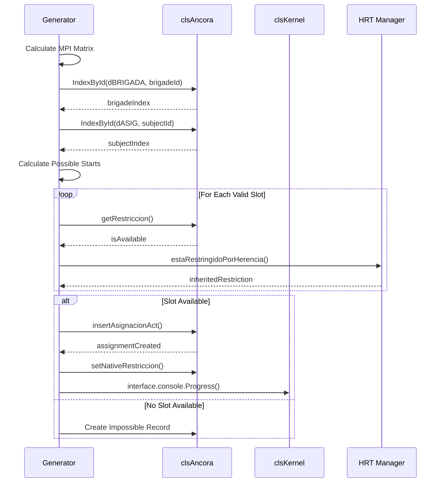

# 03. Logical Model (Modelo Lógico)

## 3.1 Package Architecture

```mermaid
graph TB
    subgraph PACKAGES["Áncora Package Structure"]
        
        subgraph KERNEL["kernel (Core)"]
            K1[clsKernel]
            K2[clsInterface]
            K3[clsReport]
            K4[libUtils]
            K5[libStrings]
            K6[libFiles]
            K7[libExcelSheets]
        end
        
        subgraph SCHEDULER["scheduler (Scheduling Engine)"]
            S1[clsAncora]
            S2[modDataGenerator]
            S3[modDataAnalizer]
            S4[modDataRepair]
        end
        
        subgraph ENTITIES["entities (Domain Objects)"]
            E1[TPeriodo]
            E2[TBrigada]
            E3[TAsig]
            E4[TClasif]
            E5[TRecurso]
            E6[TProfeXAct]
            E7[TLugarXAct]
            E8[TActAsignada]
            E9[TGOH_HRT]
        end
        
        subgraph CORE["core (Infrastructure)"]
            C1[TKernel_Hash]
            C2[TKernel_HashCollection]
            C3[TKernel_HashPxAct]
            C4[TCacheID]
            C5[TIdent]
        end
        
        subgraph ANALYSIS["analysis (Optimization)"]
            A1[TAna_Optimo]
            A2[TAna_Recursos]
            A3[TAna_PercentRestricc]
            A4[TAna_ResumenHueco]
        end
        
        subgraph UTILITIES["utilities (Helpers)"]
            U1[TAtom_Variant]
            U2[TAtom_matrixVariant]
            U3[TPrioriza]
            U4[TConsole]
        end
    end
    
    KERNEL --> SCHEDULER
    SCHEDULER --> ENTITIES
    ENTITIES --> CORE
    SCHEDULER --> ANALYSIS
    CORE --> UTILITIES
```



---

## 3.2 Class Diagram - Core System



---

## 3.3 Class Diagram - Entity Layer



---

## 3.4 Class Diagram - Generator Engine



---

## 3.5 Class Diagram - HRT System



---

## 3.6 Data Type Definitions

### 3.6.1 Core Types (UDT)

```vb
' User-Defined Types in modDataTypes.bas

Type TRestriccion
    rest(1 To MAX_DIAS, 1 To MAX_TURNOS) As Boolean
    idperiodo As String
End Type

Type TZPriori
    idperiodo As String
    rest(1 To MAX_DIAS, 1 To MAX_TURNOS) As Byte
End Type

Type TActividad
    idclasif As String
    cantProfesNecesarios As Long
    cantLugaresNecesarios As Long
End Type

Type TDesglose
    act(1 To MAX_ACT) As TActividad
    idperiodo As String
    cantact As Long
    RespetarOrden As Boolean
    min As Byte
    max As Byte
    mismodia As Boolean
End Type

Type TActAsignada
    dia As Long
    turno As Long
    idprofe As String
    idasig As String
    idact As Long
    idlugar As String
    idperiodo As String
    idbrigada As String
    fija As Boolean
End Type

Type TProfeXAct
    para As TAsignaRecurso
    idprofes As String
    cantGrupos As Long
    grupos() As Long
End Type

Type TLugarXAct
    para As TAsignaRecurso
    cantLug As Long
    idlug() As String
    priori() As Long
End Type
```

---

## 3.7 Entity Constants

```vb
' Constants in modDataConstants.bas

Public Const MAX_DIAS As Long = 7
Public Const MAX_TURNOS As Long = 12
Public Const MAX_ACT As Long = 5

Public Const dCantArreglos = 9
Public Const dPERIODO = 1
Public Const dESPECIALIDAD = 2
Public Const dCLASIF = 3
Public Const dPROFE = 4
Public Const dLUGAR = 5
Public Const dBRIGADA = 6
Public Const dASIG = 7
Public Const dDESGLOSE = 8
Public Const dRECURSO = 9
```

---

## 3.8 Global Variables



---

## 3.9 Sequence: Assignment Creation



---

## 3.10 Algorithm Overview: MPI

The **MPI (Matriz de Posibles Inicios)** is the core algorithm:

```mermaid
flowchart TD
    A[Start: Activity to Schedule] --> B[Get Classification]
    B --> C[Get Required Slots (ct)]
    
    C --> D{slot + ct <= MAX_TURNOS?}
    
    D -->|No| E[Invalid - Exit]
    D -->|Yes| F[Check Zone Priority]
    
    F --> G[Check Resource Constraints]
    G --> H{Professors Available?}
    H -->|No| I[Reason: PROFESSOR]
    H -->|Yes| J{Places Available?}
    J -->|No| K[Reason: PLACE]
    J -->|Yes| L{Brigade Available?}
    L -->|No| M[Reason: BRIGADE]
    L -->|Yes| N{All Constraints Met?}
    N -->|No| O[Reason: OTHER]
    N -->|Yes| P[Mark as Possible Start]
    
    I --> Q[Return MPI_Casilla]
    K --> Q
    M --> Q
    O --> Q
    P --> Q
```

---

*Document Status: 🔄 In Progress*
*Next: Physical Model (04-Fisico)*
