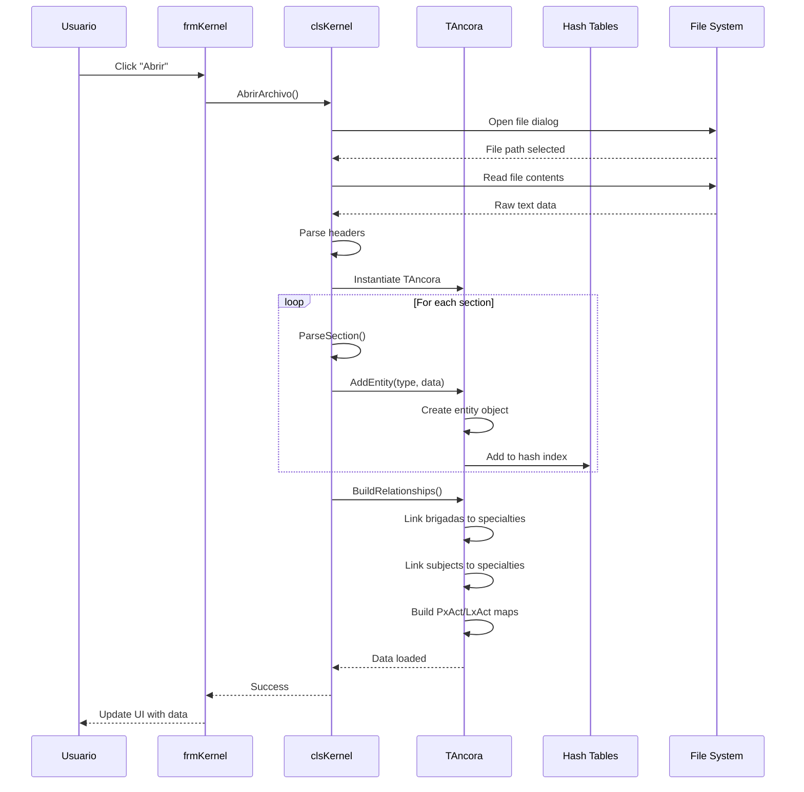
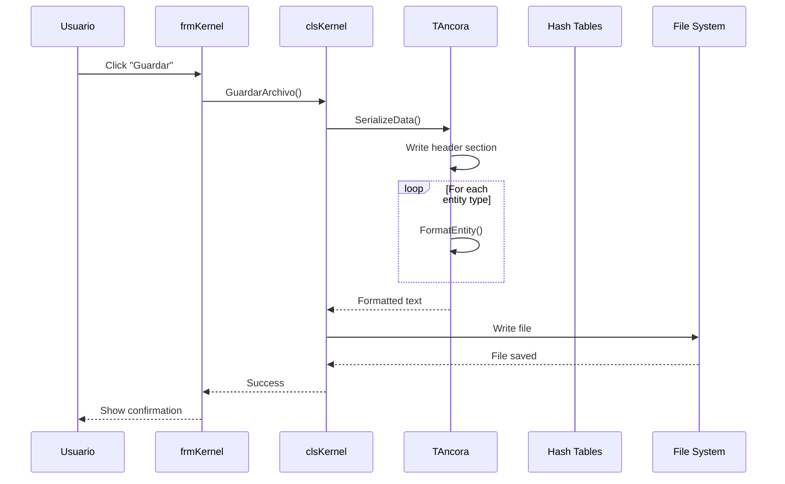
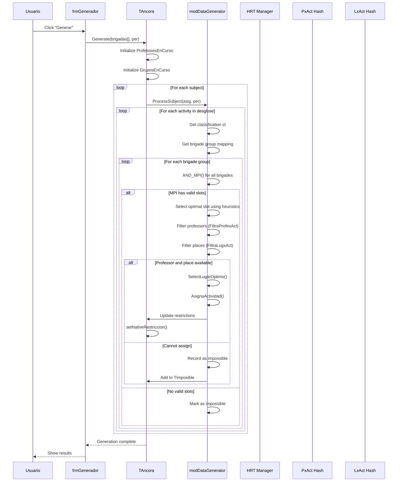
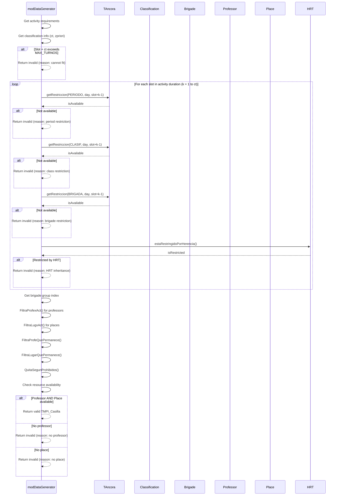
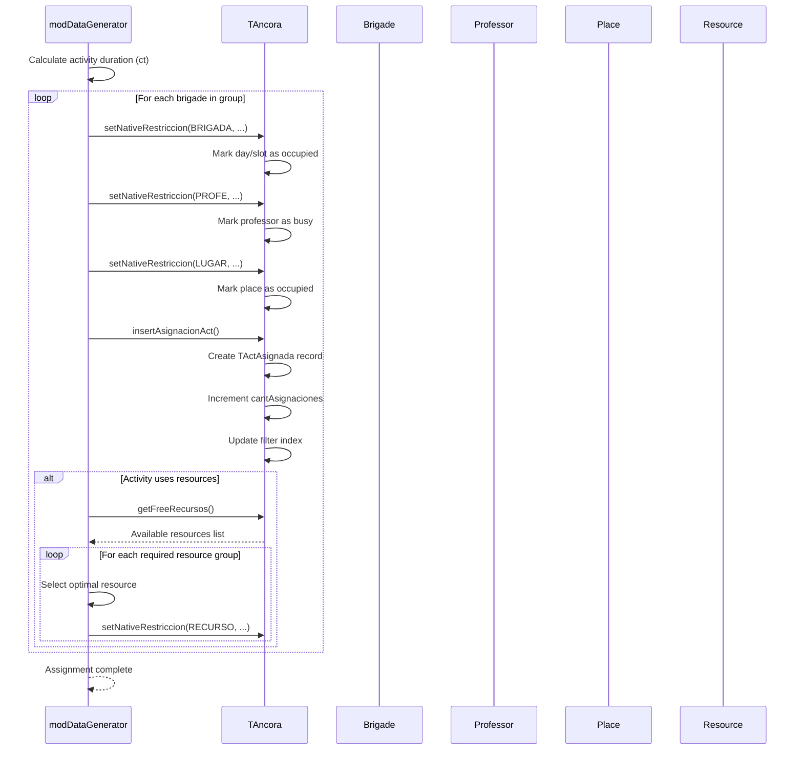
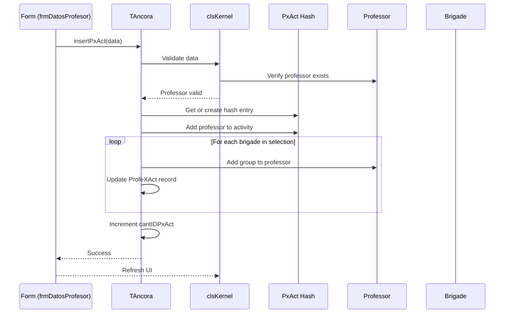
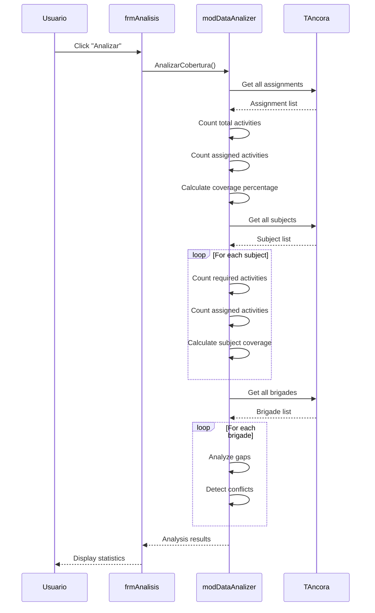
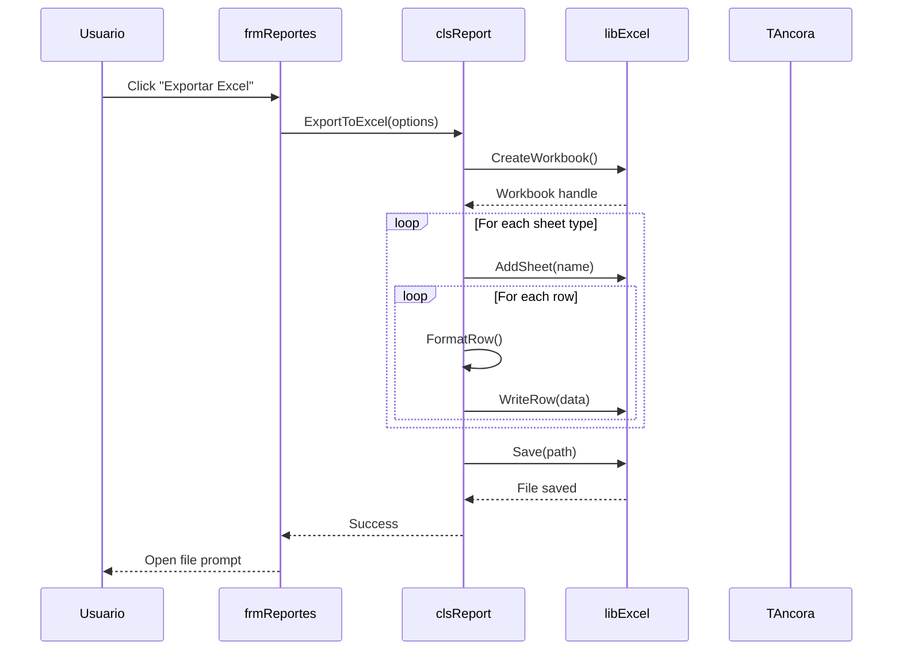
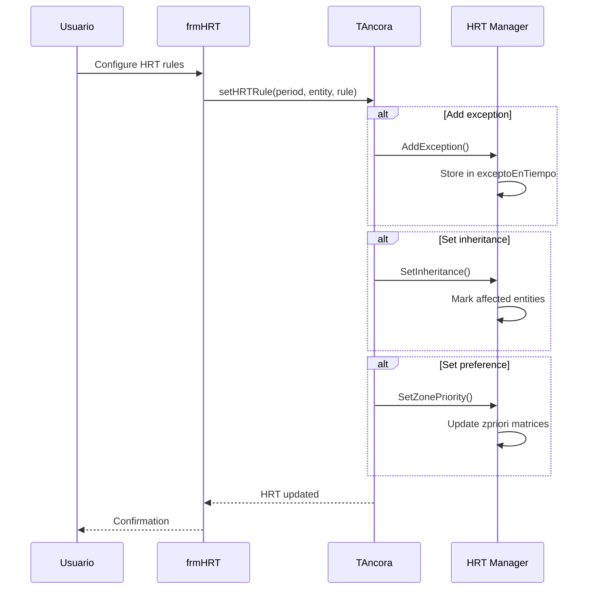
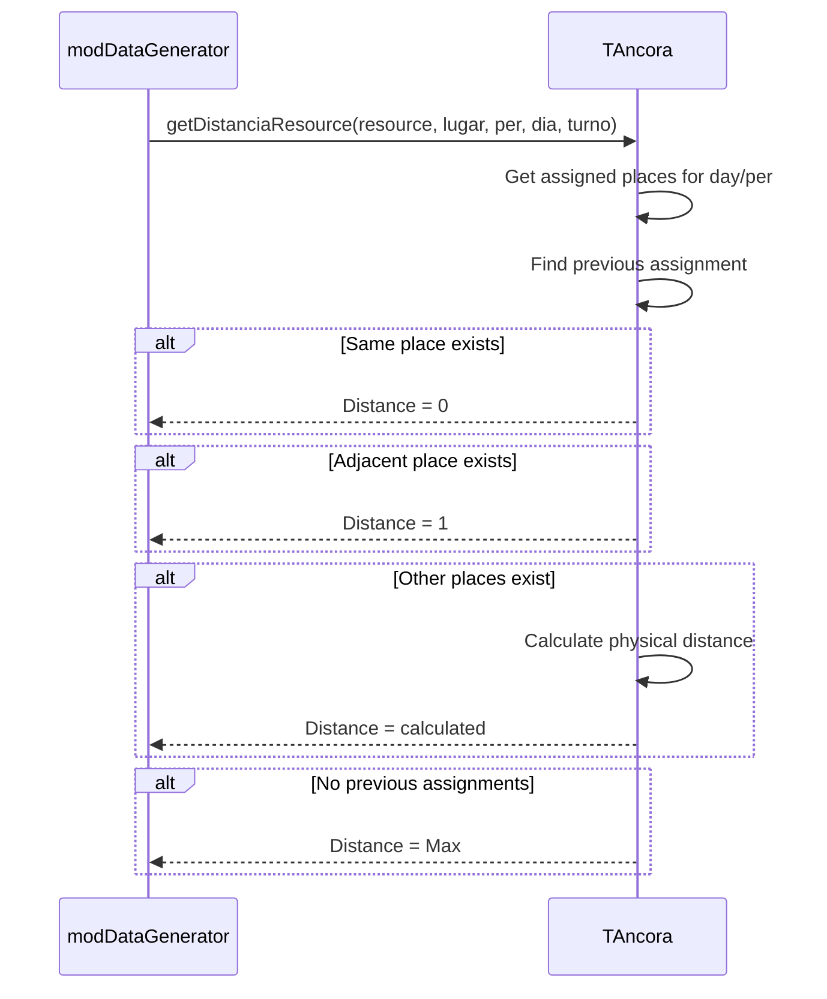

# Sequence Diagrams

> Interaction patterns and message flows between system components.

---

## S1: Cargar Archivo .anc



---

## S2: Guardar Archivo .anc



---

## S3: Generar Horario (MPI)



---

## S4: Calcular MPI (PosibleInicio)



---

## S5: Asignar Actividad



---

## S6: Insertar Profesor por Actividad



---

## S7: Análisis de Cobertura



---

## S8: Exportar a Excel



---

## S9: Gestionar HRT (Herencia)



---

## S10: Buscar Horario Libre (Place Proximity)



---

## Communication Patterns

### Request-Response
```
Client -> Server: Operation()
Server -->> Client: Result/Error
```
Used for: All CRUD operations on entities

### Callback
```
Component -> System: RegisterEvent()
System -> Component: EventCallback(data)
```
Used for: Progress updates during generation

### Observer
```
Subject -> Observers: Notify()
Observers -> Observers: Update()
```
Used for: UI refresh after data changes

### Iterator
```
for each entity in collection:
    process(entity)
```
Used for: Batch operations, report generation

---

## Key Interface Contracts

### TAncora Public Methods

| Method | Parameters | Returns | Called By |
|--------|------------|---------|-----------|
| `Load(path)` | String | Boolean | clsKernel |
| `Save(path)` | String | Boolean | clsKernel |
| `Generate(...)` | filters | void | frmGenerador |
| `Insert*(data)` | entity data | Boolean | Forms |
| `Delete*(id)` | entity ID | Boolean | Forms |
| `getCant*()` | - | Long | Forms/Reports |
| `IndexById(type, id)` | Type, ID | Long | All |

### clsKernel Public Methods

| Method | Parameters | Returns | Called By |
|--------|------------|---------|-----------|
| `LoadFile(path)` | String | Boolean | Forms |
| `SaveFile(path)` | String | Boolean | Forms |
| `AbrirArchivo()` | - | Boolean | Forms |
| `GuardarArchivo()` | - | Boolean | Forms |

---

*Document Status: 🟢 Complete*
*Last Updated: 2026-04-06*
