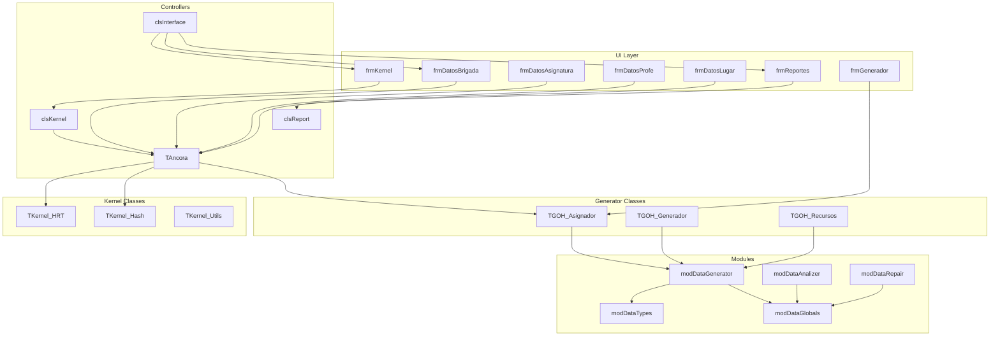
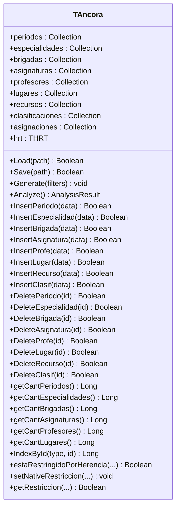
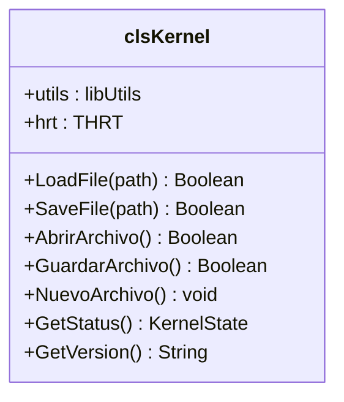
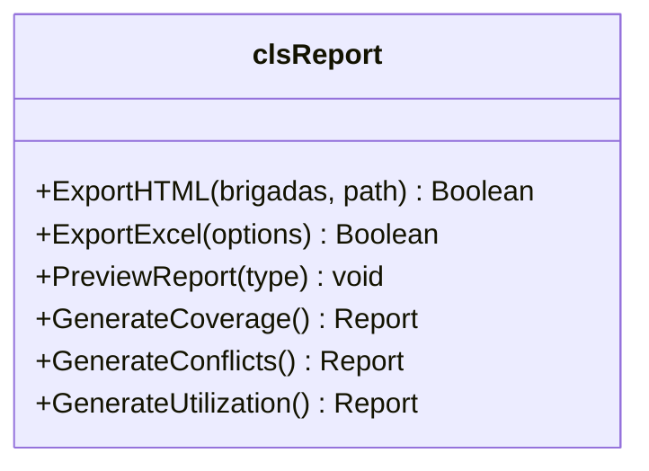
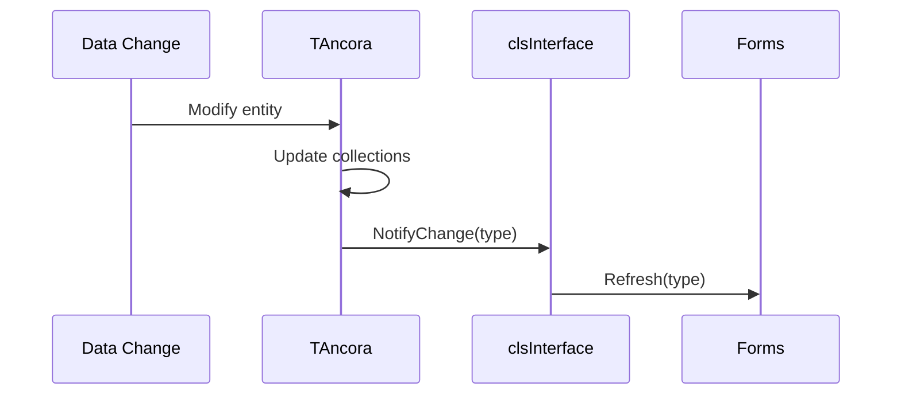
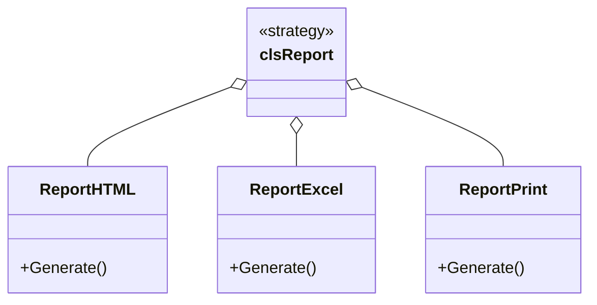
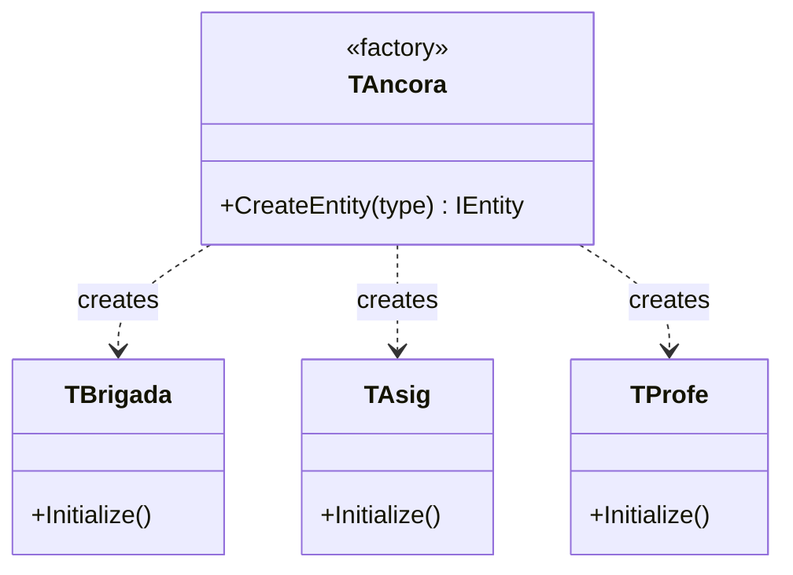

# Component Diagram

> Component relationships and deployment architecture for Áncora.

---

## Component Overview

```mermaid
componentDiagram
    package "User Interface Layer" {
        [frmKernel*] as FK
        [frmDatos*] as FD
        [frmReportes*] as FR
        [frmGenerador*] as FG
        [Ribbon.ctl] as RB
        [casillero.ctl] as CA
        [XPButton.ctl] as XB
    }
    
    package "Business Logic Layer" {
        [TAncora.cls] as TA
        [clsKernel.cls] as CK
        [clsInterface.cls] as CI
        [clsReport.cls] as CR
        [TGOH_*.cls] as TG
        [TAna_*.cls] as TN
        [TKernel_*.cls] as TK
    }
    
    package "Core Algorithms" {
        [modKernell.bas] as MK
        [modDataGenerator.bas] as MG
        [modDataAnalizer.bas] as MA
        [modDataRepair.bas] as MR
    }
    
    package "Data Layer" {
        [modDataTypes.bas] as MT
        [modDataConstants.bas] as MC
        [modDataGlobals.bas] as MGlo
        [lib*.cls] as LB
    }
    
    FK --> CK : Uses
    FD --> CK : Uses
    FR --> CR : Uses
    FG --> TG : Uses
    
    CK --> TA : Creates/Manages
    TA --> TK : Uses
    TG --> MG : Uses
    
    MG --> MT : Type definitions
    MG --> MC : Constants
    MG --> MGlo : Global data
    MA --> MGlo : Analysis
    MR --> MGlo : Repair
    
    CR --> LB : Excel/File export
    LB --> MT : Data access
```

---

## Detailed Component Descriptions

### UI Components

| Component | Type | Purpose | Dependencies |
|-----------|------|---------|--------------|
| `frmKernel*` | Form | System shell, menu, file operations | clsKernel, clsInterface |
| `frmDatos*` | Form | Data entry for all entity types | TAncora, clsKernel |
| `frmReportes*` | Form | Report viewer and exporter | clsReport |
| `frmGenerador*` | Form | Generation UI and progress | TGOH_*, modDataGenerator |
| `Ribbon.ctl` | Control | Office-style ribbon menu | - |
| `casillero.ctl` | Control | Schedule cell display | - |
| `XPButton.ctl` | Control | Styled button | - |

### Business Components

| Component | Type | Purpose | Dependencies |
|-----------|------|---------|--------------|
| `TAncora` | Class | Main controller, data management | modData*, TKernel_* |
| `clsKernel` | Class | File I/O, utilities | libUtils |
| `clsInterface` | Class | UI coordination | All forms |
| `clsReport` | Class | Report generation | libExcel, libFiles |
| `TGOH_*` | Classes | Schedule generation | modDataGenerator |
| `TAna_*` | Classes | Analysis operations | modDataAnalizer |
| `TKernel_*` | Classes | Kernel utilities (Hash, HRT) | modDataTypes |

### Algorithm Components

| Component | Purpose | Key Functions |
|-----------|---------|---------------|
| `modKernell` | Entry point | Main, Initialize, Cleanup |
| `modDataGenerator` | MPI algorithm | PosibleInicio, AND_MPI, OR_MPI |
| `modDataAnalizer` | Statistics | Coverage, Conflicts, Utilization |
| `modDataRepair` | Conflict resolution | Reorder, Reassign |

### Data Components

| Component | Purpose |
|-----------|---------|
| `modDataTypes` | All UDT definitions |
| `modDataConstants` | System constants |
| `modDataGlobals` | Global arrays and variables |
| `libExcel` | Excel integration |
| `libFiles` | File operations |
| `libStrings` | String utilities |

---

## Component Dependencies (Detailed)



---

## Public Interfaces

### TAncora Public Interface



### clsKernel Public Interface



### clsReport Public Interface



---

## Deployment Structure

```
ancora-vb6/
│
├── Binaries/
│   ├── Ancora.exe           # Main executable
│   ├── actskin4.ocx         # Skin library
│   ├── ButtonSkin.ocx       # Button skin
│   ├── Comdlg32.ocx         # Common dialogs
│   └── hhctrl.ocx           # HTML Help
│
├── Source/
│   ├── bas/                 # Standard modules
│   ├── cls/                 # Class modules
│   ├── frm/                 # Form modules
│   ├── ctl/                 # User controls
│   ├── res/                 # Resources
│   └── lib/                 # Libraries
│
├── Data/
│   ├── archivos_ejemplos/   # Sample files
│   └── ayuda/              # Help files
│
└── Docs/
    ├── tecnica/             # Technical docs
    └── migration/           # Migration plan
```

---

## Component Communication Patterns

### Observer Pattern (UI Updates)


### Strategy Pattern (Report Generation)


### Factory Pattern (Entity Creation)


---

## External Dependencies

| Component | Type | Purpose | Registration |
|-----------|------|---------|--------------|
| VB6 Runtime | Runtime | VB6 execution | System |
| Windows API | DLL | File dialogs, etc. | System |
| actskin4.ocx | OCX | Window skinning | `regsvr32` |
| ButtonSkin.ocx | OCX | Button styles | `regsvr32` |
| Comdlg32.ocx | OCX | Common dialogs | System |
| hhctrl.ocx | OCX | HTML Help | System |

---

*Document Status: 🟢 Complete*
*Last Updated: 2026-04-06*
