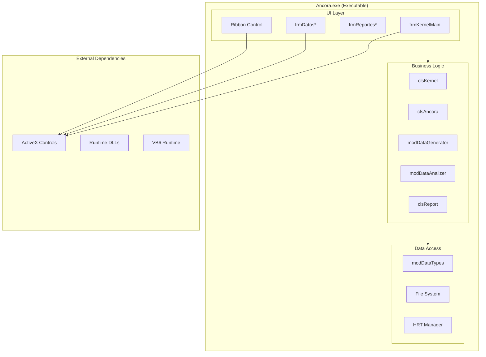
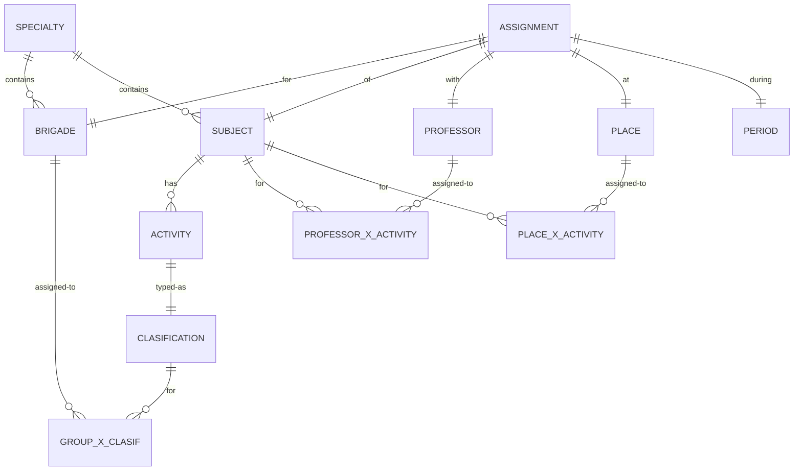
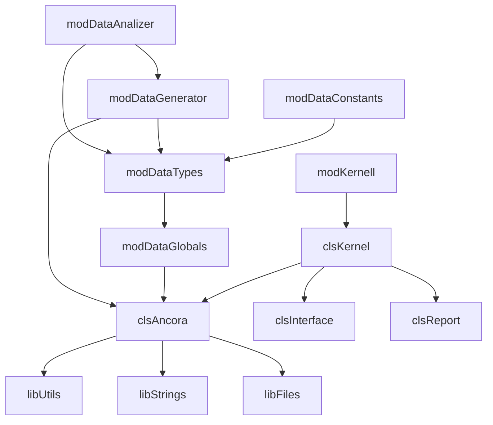
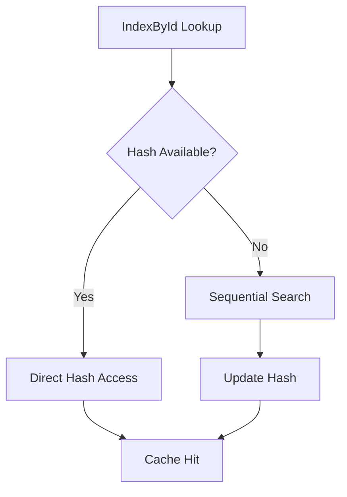

# 04. Physical Model (Modelo Físico)

## 4.1 File Structure

```
ancora-vb6/
├── bas/                              # Standard Modules
│   ├── ancora_goh_traditional_modDataTypes.bas           # Data structures (UDTs)
│   ├── ancora_goh_traditional_modDataTypesExtension*.bas # Type extensions
│   ├── ancora_goh_traditional_modDataConstants.bas      # Constants
│   ├── ancora_goh_traditional_modDataGlobals.bas       # Global variables
│   ├── ancora_goh_traditional_modKernell.bas           # Core kernel
│   ├── ancora_goh_traditional_modDataGenerator.bas      # Generation algorithms
│   ├── ancora_goh_traditional_modDataAnalizer.bas      # Analysis algorithms
│   ├── ancora_goh_traditional_modDataRepair.bas        # Repair algorithms
│   ├── ancora_goh_traditional_modDataTypesTools.bas    # Type utilities
│   └── atareas.bas                                 # TODO/Backlog notes
│
├── cls/                              # Class Modules
│   ├── ancora_goh_traditional_clsKernel.cls           # Kernel controller
│   ├── ancora_goh_traditional_clsInterface.cls         # UI interface
│   ├── ancora_goh_traditional_clsReport.cls          # Report generator
│   ├── ancora_goh_traditional_TAncora.cls            # Main data controller
│   │
│   ├── entity/                         # Entity Classes (GOH prefix)
│   │   ├── ancora_goh_traditional_TGOH_HRT.cls       # HRT inheritance
│   │   ├── ancora_goh_traditional_TGOH_Recurso.cls   # Resource
│   │   ├── ancora_goh_traditional_TGOH_RecursoXAct.cls # Resource×Activity
│   │   ├── ancora_goh_traditional_TGOH_arrRecurso.cls # Resource collection
│   │   ├── ancora_goh_traditional_TGOH_arrHRT.cls     # HRT collection
│   │   ├── ancora_goh_traditional_TGOH_Restriccion.cls # Restriction
│   │   ├── ancora_goh_traditional_TGOH_GroupRest.cls  # Group restriction
│   │   └── ancora_goh_traditional_TGOH_*.cls         # Other GOH classes
│   │
│   ├── kernel/                         # Kernel Classes
│   │   ├── ancora_goh_traditional_TKernel_Hash.cls
│   │   ├── ancora_goh_traditional_TKernel_HashCollection.cls
│   │   ├── ancora_goh_traditional_TKernel_HashPxAct.cls
│   │   ├── ancora_goh_traditional_TKernel_ProcesoEnCola.cls
│   │   └── ancora_goh_traditional_TKernel_Opcion.cls
│   │
│   ├── analysis/                      # Analysis Classes
│   │   ├── ancora_goh_traditional_TAna_Optimo.cls
│   │   ├── ancora_goh_traditional_TAna_OptimoAct.cls
│   │   ├── ancora_goh_traditional_TAna_Recursos.cls
│   │   └── ancora_goh_traditional_TAna_*.cls
│   │
│   └── util/                           # Utility Classes
│       ├── ancora_goh_traditional_TAtom_Variant.cls
│       ├── ancora_goh_traditional_TIdent.cls
│       └── TConsole.cls
│
├── frm/                              # Form Modules (UI)
│   ├── ancora_goh_traditional_frmKernelMain.frm      # Main window
│   ├── ancora_goh_traditional_frmKernel*.frm        # Kernel dialogs
│   ├── ancora_goh_traditional_frmDatos*.frm          # Data entry forms
│   ├── ancora_goh_traditional_frmReportes*.frm       # Report forms
│   ├── ancora_goh_traditional_frmGenerador*.frm     # Generator forms
│   ├── ancora_goh_traditional_frmHerramientas*.frm   # Tool forms
│   └── frm_generic_*.frm                          # Generic dialogs
│
├── ctl/                              # User Controls
│   ├── ancora_goh_traditional_Ribbon.ctl            # Ribbon menu
│   ├── ancora_goh_traditional_casillero.ctl         # Schedule cell
│   └── XPButton.ctl                                # Styled button
│
├── lib/                              # Shared Libraries
│   ├── libUtils.cls                   # Utility functions
│   ├── libStrings.cls                 # String operations
│   ├── libFiles.cls                   # File operations
│   └── libExcelSheets.cls            # Excel integration
│
├── res/                              # Resources
│   └── Themes.res                     # Visual themes
│
├── archivos_ejemplos/                 # Sample data files
│   ├── arquitectura/
│   ├── civil/
│   ├── electrica/
│   ├── industrial/
│   ├── informica/
│   ├── mecanica/
│   ├── quimica/
│   └── *.anc                          # Example schedule files
│
├── ayuda/                            # Help documentation
│   ├── index.html
│   ├── contenido/
│   └── images/
│
├── Ancora.vbp                        # VB6 Project File
├── Ancora.vbw                        # VB6 Workspace
├── README.md
├── LICENSE
└── registrar.bat                      # OCX registration script
```

---

## 4.2 Component Deployment



---

## 4.3 File Format (.anc)

### 4.3.1 Structure Overview

```mermaid
graph LR
    subgraph ANC_FILE[.anc File]
        H[Header<br/>Version Info]
        DG[Datos Generales<br/>Days × Periods]
        PE[Periodos<br/>Time Blocks]
        NV[Niveles<br/>Grade Levels]
        ES[Especialidades<br/>Specialties]
        CL[Clasificaciones<br/>Activity Types]
        BR[Brigadas<br/>Student Groups]
        GX[Grupos×Clasif<br/>Group Assignments]
        AS[Asignaturas<br/>Subjects]
        PR[Profesores<br/>Professors]
        LG[Lugares<br/>Classrooms]
        AC[Accesos Prohibidos<br/>Forbidden Access]
        AF[Aulas Fijas<br/>Fixed Rooms]
        LX[Lug×Act<br/>Place Assignments]
        PX[Prof×Act<br/>Professor Assignments]
        DT[Distancias<br/>Travel Distances]
        AG[Asignaciones<br/>Final Assignments]
        RE[Rechazadas<br/>Rejected Activities]
        RC[Recursos<br/>Resources]
        RX[Rec×Act<br/>Resource Assignments]
        HR[HRT<br/>Constraint Inheritance]
    end
```



### 4.3.2 File Format Example

```
; Áncora, generación y organización de horarios Ver 1.2.0
; Archivo de horarios
; Fecha: 4/3/2026

5                          ; Dias (CD)
5                          ; Turnos por dia (CT)

2                          ; Cantidad de Periodos
si,,,si,                   ; Periodo 1: "si"
0,0,0,0,0,                 ; Restrictions row 1
...
sp,,,sp,                   ; Periodo 2: "sp"

5                          ; Cantidad de Niveles

1                          ; Cantidad de Especialidades
info,info,info,            ; Especialidad: info

2                          ; Cantidad de Clasificaciones
conf,, 1 ,conf,            ; Conference/Theory (1 slot)
cp,clase practica, 1 ,cp,  ; Practice (1 slot)
```

---

## 4.4 Database Schema (Conceptual)



---

## 4.5 Module Dependencies



---

## 4.6 Build Configuration

### VB6 Project Settings (Ancora.vbp)

```properties
Type=Exe
Startup="Sub Main"
HelpFile=""
Title="Áncora"
ExeName32="Ancora.exe"
Description="generación y organización de horarios"
MajorVer=1
MinorVer=0
RevisionVer=1
```

### Key References

| Type | Component | Purpose |
|------|-----------|---------|
| Reference | stdole2.tlb | OLE Automation |
| Reference | FM20.DLL | MS Forms 2.0 |
| Object | COMDLG32.OCX | Common Dialog |
| Object | MSCOMCTL.OCX | Windows Controls |
| Object | RICHTX32.OCX | Rich Text |
| Object | MSFLXGRD.OCX | FlexGrid |
| Object | actskin4.ocx | Skins |
| Object | buttonskin.ocx | Button Skins |

---

## 4.7 Runtime Dependencies

```mermaid
graph LR
    subgraph RUNTIME["VB6 Runtime Components"]
        VBR[msvbvm60.dll]
        OLE[oleaut32.dll]
        COM[Comdlg32.ocx]
        CTL[MSCOMCTL.OCX]
        FLEX[MSFLXGRD.OCX]
    end
    
    subgraph OFFICE["Office Integration"]
        ADO[msado15.dll]
        OWC[OWC10.dll]
    end
    
    subgraph APP["Application"]
        APP[Ancora.exe]
    end
    
    APP --> VBR
    APP --> OLE
    APP --> COM
    APP --> CTL
    APP --> FLEX
    APP --> ADO
    APP --> OWC
```

---

## 4.8 Configuration Files

| File | Purpose |
|------|---------|
| `ancora.cfg` | Application settings |
| `ancora.skn` | Skin configuration |
| `server.conf` | Server connection config |
| `registrar.bat` | OCX registration |

---

## 4.9 Performance Considerations

### Array Limits
- Maximum Days: 7
- Maximum Periods per Day: 12
- Maximum Activities per Period: 5
- Maximum Assignments: Limited by memory

### Hash Indexes


---

*Document Status: 🔄 In Progress*
*Next: Architecture Documentation*
