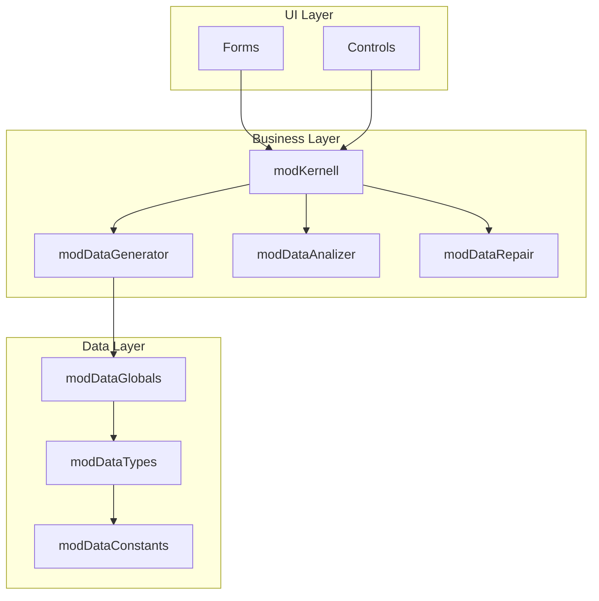
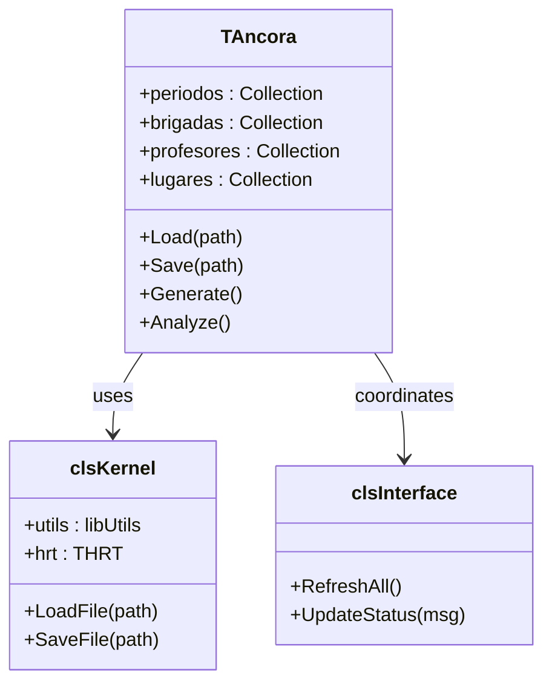

# Package Structure

> Module organization and dependencies in Áncora.

## Directory Layout

```
ancora-vb6/
├── bas/                    # Standard Modules
│   ├── modDataTypes.bas         # Type definitions (UDTs)
│   ├── modDataConstants.bas     # Global constants
│   ├── modDataGlobals.bas       # Global variables
│   ├── modKernell.bas          # Core engine entry point
│   ├── modDataGenerator.bas    # MPI scheduling algorithm
│   ├── modDataAnalizer.bas     # Analysis routines
│   ├── modDataRepair.bas       # Conflict resolution
│   └── atareas.bas             # Historical TODO notes
│
├── cls/                    # Class Modules
│   ├── TAncora.cls              # Main controller
│   ├── clsKernel.cls            # Kernel controller
│   ├── clsInterface.cls        # UI coordination
│   ├── clsReport.cls           # Report generation
│   ├── TGOH_*.cls              # Generator classes
│   ├── TAna_*.cls             # Analysis classes
│   ├── TKernel_*.cls          # Kernel utility classes
│   └── lib*.cls               # Library classes
│
├── frm/                    # Form Modules (UI)
│   ├── frmKernel*.frm          # System forms
│   ├── frmDatos*.frm          # Data entry
│   ├── frmReportes*.frm       # Reports
│   └── frmGenerador*.frm      # Generator UI
│
├── ctl/                    # User Controls
│   ├── Ribbon.ctl               # Office-style ribbon
│   ├── casillero.ctl           # Schedule cell
│   └── XPButton.ctl           # Styled button
│
├── res/                    # Resources
├── lib/                    # Shared libraries
├── archivos_ejemplos/       # Sample .anc files
├── ayuda/                  # Help documentation
└── Ancora.vbp             # VB6 project file
```

## Module Dependencies



## Module Descriptions

### bas/ (Standard Modules)

| Module | Responsibility | Key Exports |
|--------|----------------|--------------|
| `modDataTypes` | UDT definitions | All type declarations |
| `modDataConstants` | Constants | MAX_DIAS, MAX_TURNOS, array indices |
| `modDataGlobals` | Global state | Periods, Brigades, Subjects, etc. |
| `modKernell` | Entry point | Data loading, file I/O |
| `modDataGenerator` | MPI algorithm | Schedule generation |
| `modDataAnalizer` | Statistics | Coverage, conflicts |
| `modDataRepair` | Recovery | Conflict resolution |
| `atareas` | Documentation | Historical TODOs |

### cls/ (Class Modules)

| Class Prefix | Purpose |
|--------------|---------|
| `TAncora*` | Main controller |
| `TGOH_*` | Schedule generation |
| `TAna_*` | Analysis operations |
| `TKernel_*` | Kernel utilities |
| `lib*` | Reusable utilities (Excel, Files, Strings) |

### frm/ (Forms)

| Prefix | Purpose |
|--------|---------|
| `frmKernel*` | System/kernel UI |
| `frmDatos*` | Data management |
| `frmReportes*` | Report views |
| `frmGenerador*` | Generator UI |

## Public Interface

### Core Classes (Public Methods)



## Legacy Patterns

### Array-Based Storage (Pre-OOP)

Many entities still use parallel arrays rather than collections:

```vb
' Old pattern (still common)
Public brigadas() As TBrigada
Public cantBrg As Long

' Modern pattern (in classes)
Public Property Get Brigades() As Collection
```

### Mixed Naming

| Spanish | English | Both Used |
|---------|---------|-----------|
| `cantBrg` | `AssignmentCount` | Yes |
| `insertLxAct_lug` | `InsertLocation` | Yes |
| `getCantBrg()` | `GetBrigadeCount()` | Yes |

## Refactoring Targets

| Area | Issue | Priority |
|------|-------|----------|
| Global arrays | No encapsulation | High |
| Mixed naming | Cognitive load | Medium |
| Form dependencies | Tight coupling | Medium |
| Error handling | Scattered | Low |

---

*Last Updated: 2026-04-06*
