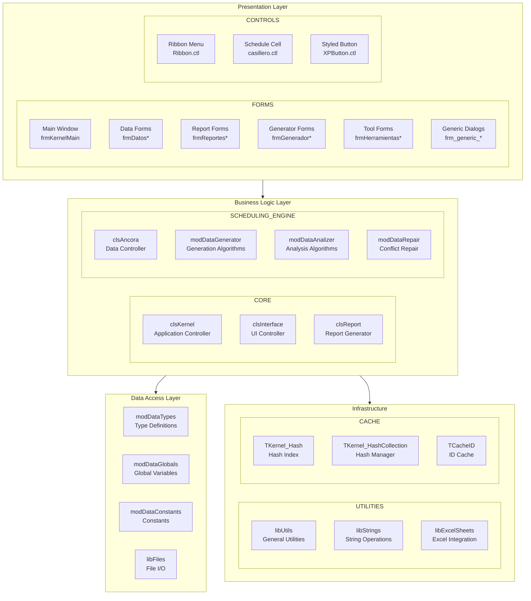
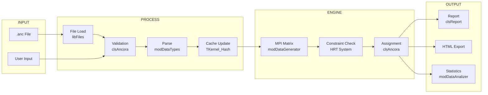
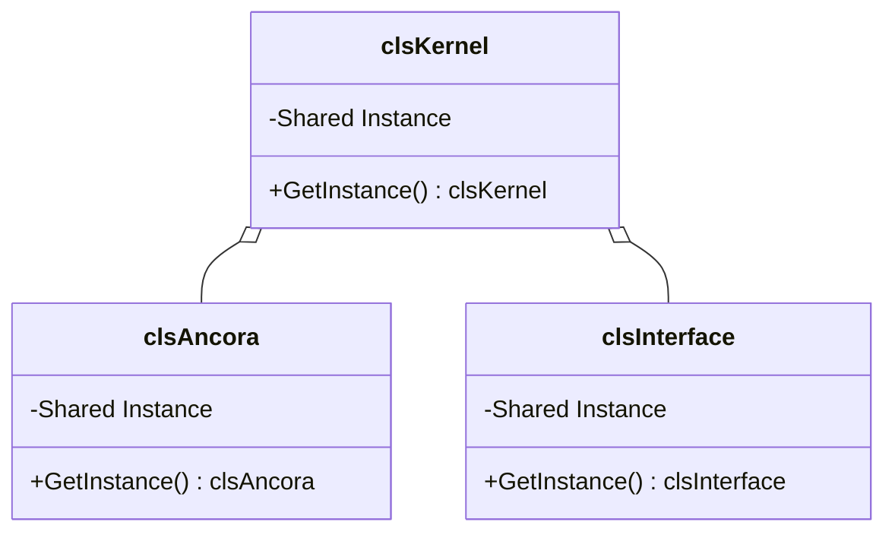
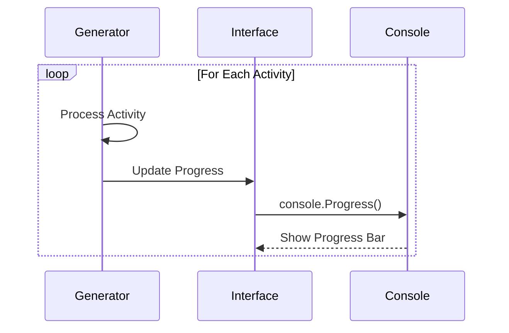
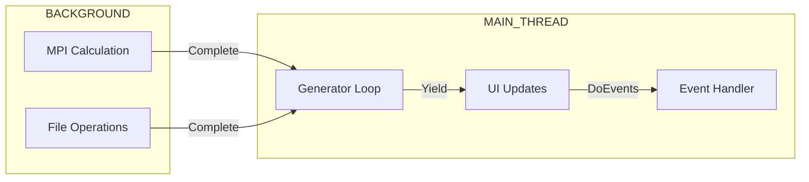
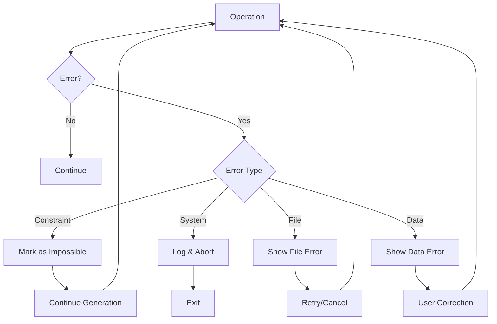

# Architecture Documentation

## System Architecture Overview



---

## Component Responsibilities

### 1. Presentation Layer

| Component | Responsibility |
|-----------|----------------|
| `frmKernelMain` | Main application window, menu system |
| `frmDatos*` | CRUD operations for entities |
| `frmReportes*` | Report generation and display |
| `frmGenerador*` | Schedule generation wizard |
| `Ribbon.ctl` | Modern menu interface |

### 2. Business Logic Layer

| Component | Responsibility |
|-----------|----------------|
| `clsKernel` | Initialize/teardown, global coordination |
| `clsAncora` | All data operations, entity management |
| `modDataGenerator` | MPI algorithm, assignment creation |
| `modDataAnalizer` | Statistics, gap detection |
| `modDataRepair` | Conflict resolution |
| `clsInterface` | UI state management |
| `clsReport` | Report formatting and export |

### 3. Data Layer

| Component | Responsibility |
|-----------|----------------|
| `modDataTypes` | UDT definitions |
| `modDataGlobals` | Global variable declarations |
| `modDataConstants` | Constant definitions |

### 4. Infrastructure

| Component | Responsibility |
|-----------|----------------|
| `libUtils` | ID comparison, percentage, formatting |
| `libStrings` | String manipulation |
| `libFiles` | File path operations |
| `TKernel_Hash*` | Fast index lookup |

---

## Data Flow Architecture



---

## Module Interaction Patterns

### Singleton Pattern


### Observer Pattern (Progress Updates)


---

## Concurrency Model



> **Note**: VB6 is single-threaded. Background operations use `DoEvents` for UI responsiveness.

---

## Error Handling Strategy



---

## Performance Optimization

### 1. Hash-Based Lookups
```mermaid
flowchart LR
    A[Lookup by ID] --> B{Hash Exists?}
    B -->|Yes| C[O(1) Access]
    B -->|No| D[Rebuild Hash]
    D --> C
```

### 2. Constraint Caching
- HRT (Herencia de Restricciones de Tiempo) cached per entity
- Invalidation on data modification

### 3. MPI Matrix Optimization
- Lazy evaluation of possible starts
- Incremental updates on single assignment

---

## Extension Points

| Extension | Implementation |
|-----------|----------------|
| New Entity Type | Extend constants + entity classes |
| New Constraint | Add to HRT system |
| New Report | Implement in clsReport |
| New Algorithm | Add to modDataGenerator |

---

## Security Considerations

1. **File Access**: Local .anc files only
2. **No Authentication**: Single-user desktop application
3. **Input Validation**: All user inputs validated before processing
4. **Error Messages**: Sanitized to prevent information leakage

---

*Document Status: 🔄 In Progress*
