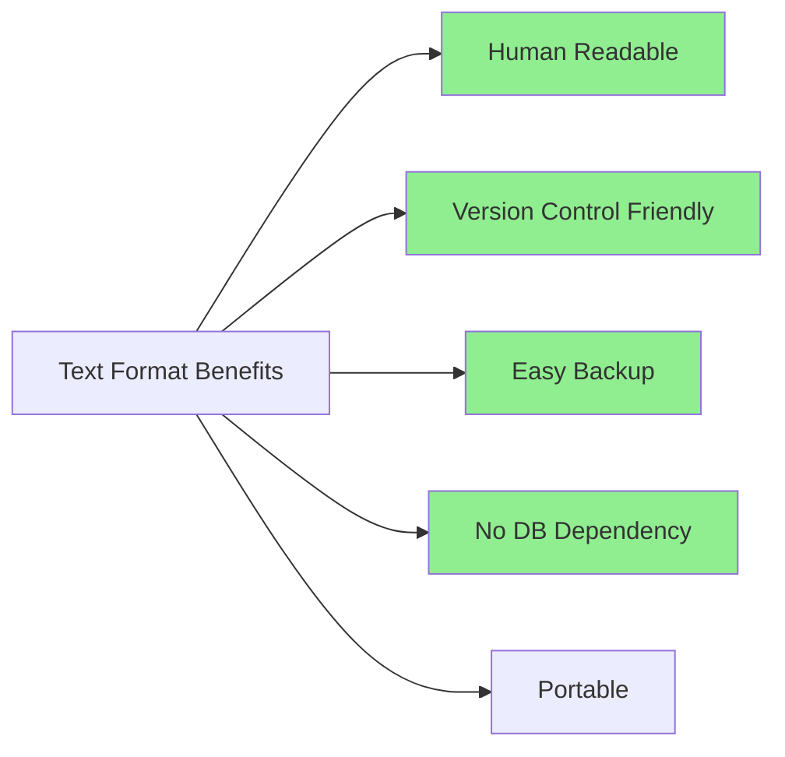
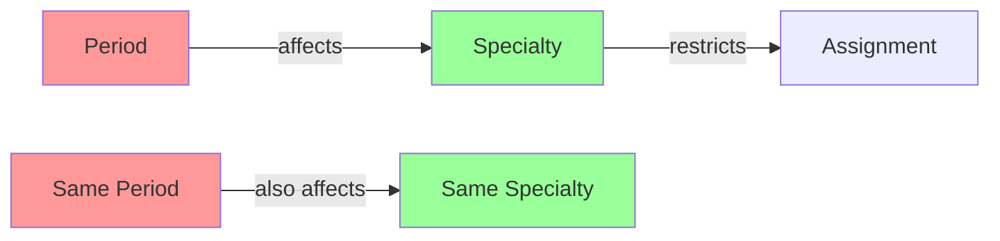
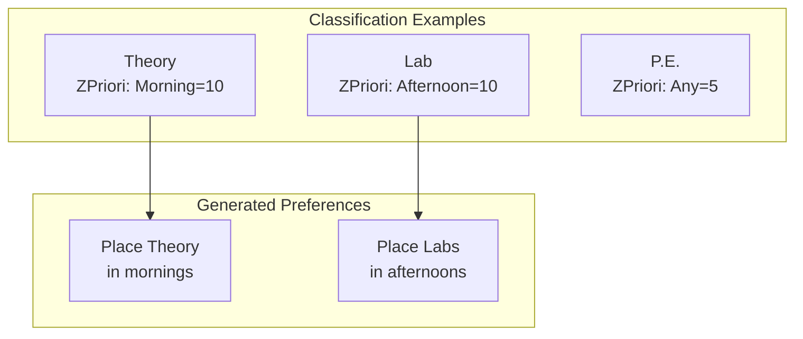
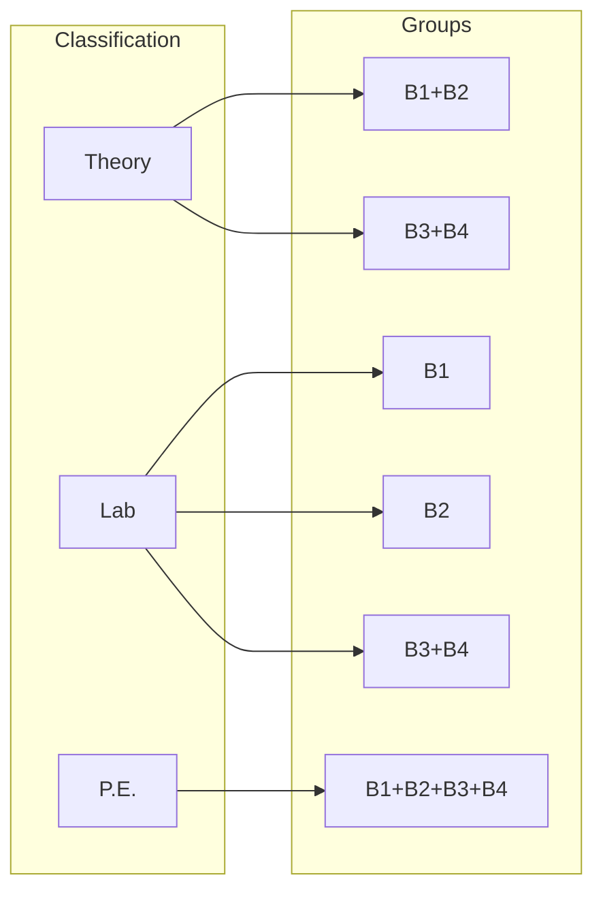
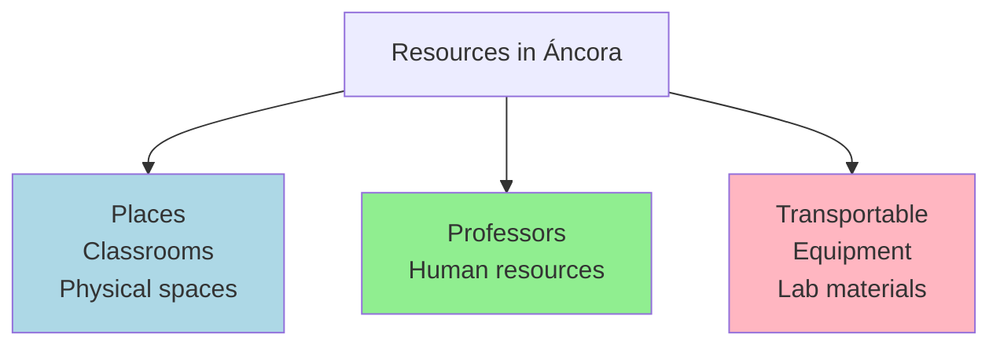
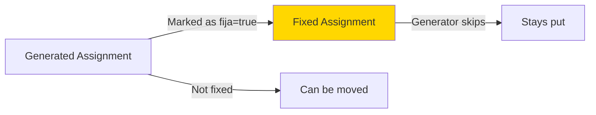
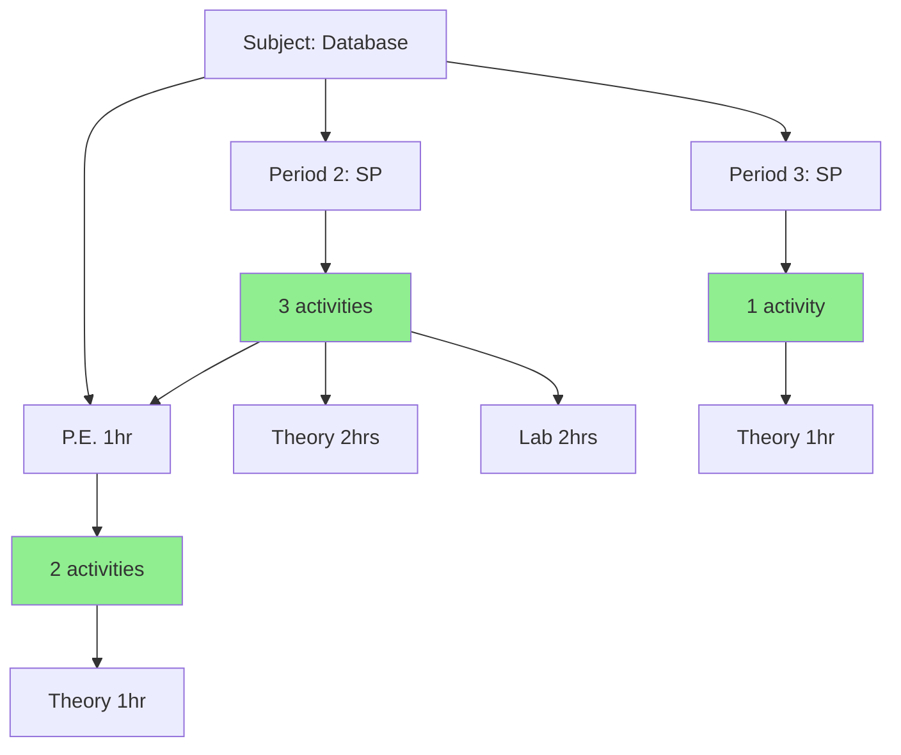

# Design Decisions & Architecture Rationale

## Overview

This document captures the **why** behind key architectural decisions in Áncora. Understanding these decisions is critical for any modernization effort.

---

## 1. Plain Text File Format (.anc)

### Decision: Use plain text instead of database/binary

**Context:**
- Application started circa 2005
- No database infrastructure available
- Need for human readability and easy backup

**Rationale:**


**Consequences:**
| Pro | Con |
|-----|-----|
| Easy debugging | No referential integrity |
| Version control works | Slower for large datasets |
| Portable | No concurrent access |
| Backup is simple text copy | Parsing overhead |

**Modernization Suggestion:**
- Keep .anc as optional import/export format
- Primary storage: PostgreSQL (as in v2.0)
- Consider JSON/YAML for API compatibility

---

## 2. Global Variables for Entity Arrays

### Decision: Use global arrays instead of collection properties

**Code Example:**
```vb
' Global arrays in modDataGlobals.bas
Public Especialidad() As TRecurso
Public Brigadier() As TBrigada
Public asig() As TAsig
Public clasif() As TClasif
```

**Rationale:**
- Simpler access: `Brigadier(5)` vs `ancora.Brigades(5)`
- VB6 class limitations for large arrays
- Performance: Direct array access vs property getter

**Problems This Creates:**
1. No encapsulation - any code can modify arrays
2. Difficult to track changes (no events)
3. Hard to implement undo/redo
4. No lazy loading

**Modernization Suggestion:**
```vb
' Instead of global arrays:
Public Property Get Brigades() As List(Of Brigade)
    Return _brigades
End Property

' With INotifyPropertyChanged for UI binding
```

---

## 3. String IDs for Entity References

### Decision: Store entity references as strings, resolve at runtime

**Code Example:**
```vb
Type TActAsignada
    dia As Long
    turno As Long
    idprofe As String      ' String ID, not index
    idasig As String      ' String ID, not index
    idlugar As String     ' String ID, not index
    idbrigada As String    ' String ID, not index
End Type
```

**Rationale:**
- Import/export is straightforward
- No index remapping needed when entities change
- Human-readable in file format

**Consequences:**
| Pro | Con |
|-----|-----|
| Durable references | Runtime lookup overhead |
| Human readable | Potential orphaned references |
| Easy serialization | IndexById() calls everywhere |

**Lookup Process:**
```vb
' Every assignment access requires resolution:
Dim professorIndex As Long = ancora.IndexById(dPROFE, assignment.idprofe)
Dim professorName As String = profe(professorIndex).descrip
```

**Modernization Suggestion:**
- Use GUIDs for entity IDs
- Foreign keys in database
- Cached index lookups

---

## 4. HRT (Herencia de Restricciones de Tiempo)

### Decision: Allow constraints to inherit between entities

### What is HRT?



**Use Case Example:**
```
Period "SI" (Semana Impar) is restricted for Engineering students
↓
Automatically restrict Engineering brigades during "SI" period
↓
Save manual configuration work
```

### Why This Complexity?

1. **Parametric System**: The system must adapt to ANY country's rules
2. **Flexibility**: Not hard-code specific institution requirements
3. **HRT allows**: "If Period X is restricted, then Entity Y is also restricted"

**Implementation:**
```vb
Type TGOH_HRT
    tipoObjetoA As Long      ' Period, Specialty, etc.
    tipoObjetoB As Long      ' Specialty, Brigade, etc.
    idObjetoA As String      ' ID of period
    idObjetoB As String      ' ID of affected entity
    exceptoEnTiempo As TGOH_arrRestriccion  ' Exceptions
End Type
```

### Modernization Suggestion:
- HRT is powerful but confusing
- Document extensively
- Consider UI simplification
- Consider declarative constraints instead of procedural inheritance

---

## 5. Zone Priority (ZPriori) System

### Decision: Allow per-classification time preferences



**Why ZPriori Exists:**
- Universities have preferred times for activity types
- Theory usually in morning (better attention)
- Labs in afternoon (flexibility)
- Physical education outdoors when weather permits

**Implementation:**
```vb
Type TZPriori
    idperiodo As String
    rest(1 To MAX_DIAS, 1 To MAX_TURNOS) As Byte  ' Priority 1-35
End Type

Type TClasif
    comun As TRecurso
    ct As Long              ' Consecutive slots needed
    continuos As Boolean    ' Must be same day
    zpriori() As TZPriori   ' Zone priorities per period
End Type
```

---

## 6. Multiple Professors/Places per Activity

### Decision: Support N:M relationships with priorities

**Why This Matters:**
```
Scenario: "Database Systems" class
├── Lecture: Prof. Smith OR Prof. Jones
├── Lab: Room A-101 (preferred) OR Room A-102 (backup)
└── Practice: Any room with computers

The generator must:
1. Try primary professor first
2. Fall back to alternate if unavailable
3. Same logic for rooms
```

**Implementation:**
```vb
' TLugarXAct: Many places per activity
Type TLugarXAct
    para As TAsignaRecurso      ' Subject, period, activity
    cantLug As Long
    idlug() As String           ' Place IDs
    priori() As Long             ' Priority (1=highest)
End Type

' TProfeXAct: Many professors per activity
Type TProfeXAct
    para As TAsignaRecurso
    idprofes As String          ' Single professor ID
    cantGrupos As Long
    grupos() As Long             ' Groups this prof teaches
End Type
```

---

## 7. Activity Classification System

### Decision: Activities typed by "Classification" not "Type"

**Common Mistake:**
```
❌ Type = "Theory" | "Lab" | "Practice"
```

**Áncora's Approach:**
```
✅ Classification = "Conference" | "Practical Class" | "Lab" | "Workshop"
```

**Why This Matters:**
```
Classification contains:
├── ct (consecutive slots - how long)
├── continuos (must same day?)
├── zpriori (time preferences)
├── restricciones (availability matrix)
└── gruposXClasif (which brigades together)
```

**Example:**
```vb
' Classification: "cp" (Clase Práctica)
clasif(1).ct = 2              ' Needs 2 consecutive slots
clasif(1).continuos = True    ' Must be same day
clasif(1).zpriori(...) = 10  ' Prefers morning

' Classification: "conf" (Conference)
clasif(2).ct = 1              ' Single slot
clasif(2).continuos = False   ' Can be any day
clasif(2).zpriori(...) = 5    ' Flexible
```

---

## 8. Brigade Groups per Classification

### Decision: Same brigades may be grouped DIFFERENTLY for different activities

**The Problem:**
```
Brigades: B1, B2, B3, B4 (Year 1 students)

For Theory: B1+B2 together, B3+B4 together
For Lab: B1 alone, B2 alone, B3+B4 together
For P.E.: All together
```

**This is NOT hierarchical - it's a matrix:**



**Why This Design:**
- More realistic scheduling flexibility
- Different activities have different group dynamics
- Reflects actual university organization

**Implementation:**
```vb
Type TGxClasif
    idclasif As String      ' Classification ID
    grupo As Long           ' Group number
End Type

Type TBrigada
    comun As TRecurso
    idesp As String
    Nivel As Long
    cantGxClasif As Long
    GrupoXClasif() As TGxClasif  ' Groups per classification
End Type
```

---

## 9. Separate Resource Types

### Decision: Distinguish 3 types of resources



**Why This Matters:**

| Type | Constraints | Assignment |
|------|------------|-----------|
| Place | Capacity, availability | Auto-assigned by generator |
| Professor | Availability, group teaching | Auto-assigned by generator |
| Transportable | None | Assigned WITH activity |

**Transportable Resources:**
```vb
' Example: Projector for Computer Lab
recurso.add "proj-001", "Projector 1", "Portable projector"

' Assignment to activity:
rxact.add 1, "si", "bd101", groups  ' Activity 1 needs projector
```

---

## 10. The "Semester" vs "Period" Concept

### Decision: Support multiple time periods (weeks)

**Common Confusion:**
```
User expects: One semester = one schedule
Reality: Multiple periods per schedule
```

**Why Multiple Periods?**
```
Period "SI" (Semana Impar - Odd Week)
Period "SP" (Semana Par - Even Week)

Use case:
- Some classes every odd week
- Some classes every even week
- Some classes every week
```

**Template System:**
```vb
' Period has a template reference:
Período "SI"
├── id: "si"
├── descrip: "Semana Impar"
├── template: "" (none - standalone)

Período "SP"  
├── id: "sp"
├── descrip: "Semana Par"
├── template: "si" (inherits restrictions from "si")
```

---

## 11. Fixed vs Generated Assignments

### Decision: Allow manual assignment locks



**Why Fixed Assignments?**
- Some classes MUST be at specific times (fixed by administration)
- Generator should not move these
- Conflicts should suggest alternative adjustments

---

## 12. Hash Indexing for Performance

### Decision: Build hash indexes for O(1) lookups

**The Problem:**
```vb
' Naive: O(n) search every time
For i = 1 To cantBrg
    If Brigadier(i).comun.id = "B1" Then
        Return i
    End If
End For
```

**The Solution:**
```vb
' Hash index: O(1) lookup
Public hashBrg As TKernel_Hash_arrIndexOf

' Built after data load:
For i = 1 To cantBrg
    hashBrg.add Brigadier(i).comun.id, i
Next

' Lookup:
If hashBrg.Existe("B1") Then
    Return hashBrg("B1").idx
End If
```

**Modernization Suggestion:**
- Database indexes serve this purpose
- Hash indexes only needed for in-memory lookups
- Consider caching strategy for hot data

---

## 13. The "Desglose" (Activity Breakdown)

### Decision: Subject activities vary by period



**Why This Matters:**
- A subject isn't a fixed weekly schedule
- Activities change by semester/period
- Allows complex semester planning

---

## 14. Distance Matrix for Optimization

### Decision: Track physical distance between places

**Purpose:**
```
Minimize student travel between consecutive classes.

Scenario:
├── Room A-101 at 8:00 AM
├── Room B-203 at 9:00 AM  
└── Distance: 500 meters

If alternative available:
├── Room A-101 at 8:00 AM
├── Room A-102 at 9:00 AM
└── Distance: 0 meters ← Choose this
```

**Implementation:**
```vb
Type TFilaDistancia
    id As String                    ' Place ID
    colum() As TColumDistancia     ' Distance to each other place
End Type

Type TColumDistancia
    id As String                   ' Target place ID
    dist As Long                   ' Distance value
End Type
```

**Modernization Suggestion:**
- Use GPS coordinates instead of manual matrix
- Calculate distances automatically from positions
- Consider building layout as input

---

## 15. Analysis vs Generation

### Decision: Separate analysis from generation

**Analysis Functions:**
- `DameHuecosComunes()` - Find common empty slots
- `PercentRestriccion()` - Calculate restriction percentage
- `BrgGenerando()` - Filter brigades for generation

**Why Separate?**
```
1. Pre-generation analysis helps configure system
2. Post-generation analysis reports quality metrics
3. Both use same data, different purposes
```

**Modernization Suggestion:**
- Move to separate AnalysisService
- Use pipeline pattern: Analyze → Generate → Analyze → Report

---

## 16. The Assistant (Wizard) Pattern

### Decision: Include step-by-step wizard for new users

**Rationale:**
- Users unfamiliar with scheduling concepts
- Need to understand relationships
- Guide through required data entry

**Wizard Steps (15 total):**
1. Create/Open file
2. Configure time (days × periods)
3. Enter periods
4. Define levels
5. Enter specialties
6. Build brigades
7. Classify activities
8. Enter places
9. Enter resources
10. Group brigades per classification
11. Enter professors
12. Enter subjects
13. Define activities per period (desglose)
14. Set distances
15. Assign resources to activities

**Modernization Suggestion:**
- Consider web-based quick-start wizard
- Progressive disclosure vs all-at-once
- Skip for experienced users

---

## Summary: Key Insights for Modernization

| Area | Current | Modernization Target |
|------|---------|---------------------|
| Storage | Plain text .anc | PostgreSQL + API |
| Entities | Global arrays | ORM entities |
| IDs | String | GUID |
| Constraints | Procedural HRT | Declarative rules |
| UI | VB6 Forms | React/Vue web app |
| Algorithm | VB6 MODs | Separate microservice |
| Analysis | Embedded | Analytics platform |
| Export | HTML templates | JSON API |

---

*Document Status: 🔄 In Progress*
*This document captures design decisions. Updates welcome.*
