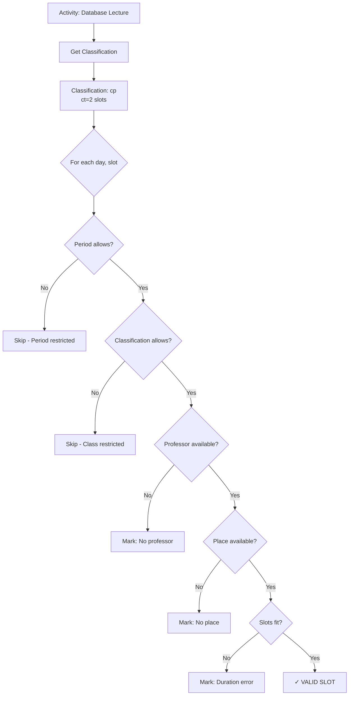

# LLM Survival Guide for Áncora Codebase

## Critical Information for AI/LLM Code Assistants

---

## 1. Entity Naming Conventions (CRITICAL)

### Spanish → English Mapping

| Spanish Variable | English Meaning | Context |
|-----------------|----------------|---------|
| `cantAsignaciones` | AssignmentCount | Number of scheduled activities |
| `cantPxAct` | ProfXActCount | Professor×Activity associations |
| `cantLxAct` | PlaceXActCount | Place×Activity associations |
| `cantBrg` | BrigadeCount | Number of brigades |
| `cantEsp` | SpecialtyCount | Number of specialties |
| `cantImposibles` | FailedCount | Activities that couldn't be scheduled |
| `cantProfe` | ProfessorCount | Number of professors |
| `cantLug` | PlaceCount | Number of places |
| `cantAsig` | SubjectCount | Number of subjects |
| `cantClasif` | ClassificationCount | Number of classifications |

### Array Suffixes

| Suffix | Meaning | Example |
|--------|---------|---------|
| `()*` | Dynamic array | `Brigadier()` |
| `XAct` | ×Activity | `LugXact()` (Place×Activity) |
| `PxAct` | Professor×Activity | `ProfeXAct()` |
| `GxClasif` | Group×Classification | `GrupoXClasif()` |

### ID Constants

| Constant | Value | Entity |
|----------|-------|--------|
| `dPERIODO` | 1 | Time block |
| `dESPECIALIDAD` | 2 | Academic program |
| `dCLASIF` | 3 | Activity type |
| `dPROFE` | 4 | Professor |
| `dLUGAR` | 5 | Classroom/place |
| `dBRIGADA` | 6 | Student group |
| `dASIG` | 7 | Subject |
| `dDESGLOSE` | 8 | Activity breakdown |
| `dRECURSO` | 9 | Equipment |

---

## 2. Type Definitions (User-Defined Types)

### Core Assignment Type

```vb
' THE MOST IMPORTANT TYPE - Represents a scheduled activity
Type TActAsignada
    dia As Long              ' Day number (1-MAX_DIAS)
    turno As Long           ' Period number (1-MAX_TURNOS)
    idprofe As String       ' Professor ID (NOT INDEX - use IndexById())
    idasig As String        ' Subject ID
    idact As Long           ' Activity index within subject
    idlugar As String       ' Place ID
    idperiodo As String     ' Period ID (e.g., "si", "sp")
    idbrigada As String     ' Brigade ID
    fija As Boolean         ' TRUE = locked, generator won't move it
    fecha As String         ' Creation date
    hora As String * 8       ' Creation time
    recursos() As String     ' Assigned transportable resources
    cantrecursos As Long
End Type
```

### Restriction Matrix

```vb
' AVAILABILITY = FALSE means OCCUPIED/RESTRICTED
' ⚠️ CONFUSING: Rest = True means "not available"
Type TRestriccion
    rest(1 To MAX_DIAS, 1 To MAX_TURNOS) As Boolean
    ' TRUE = slot is occupied/restricted
    ' FALSE = slot is available
    idperiodo As String
End Type
```

---

## 3. Common Patterns (Copy-Paste These)

### Pattern 1: Safe ID Lookup

```vb
' WRONG: Direct array access
Dim name As String = profe(index).descrip

' RIGHT: Use IndexById with NULL check
Dim idx As Long = ancora.IndexById(dPROFE, someId)
If idx > 0 Then
    name = profe(idx).descrip
End If
```

### Pattern 2: Iterate All Assignments

```vb
' WRONG: Hardcoded array bounds
For i = 1 To 100
    ' ...
Next

' RIGHT: Use count variable
For i = 1 To ancora.cantAsignaciones
    With Asignaciones(i)
        ' Access .idasig, .idprofe, etc.
    End With
Next
```

### Pattern 3: Check Assignment Validity

```vb
' Check if activity already assigned
Function IsAssigned(idasig As String, idact As Long) As Boolean
    Dim i As Long
    For i = 1 To ancora.cantAsignaciones
        If kernel.utils.idigual(Asignaciones(i).idasig, idasig) _
           And Asignaciones(i).idact = idact Then
            IsAssigned = True
            Exit Function
        End If
    Next
    IsAssigned = False
End Function
```

### Pattern 4: Access Subject Activity

```vb
' Get activity classification
Dim idxAsig As Long = ancora.IndexById(dASIG, asignacion.idasig)
Dim idxDesgl As Long = ancora.IndexById(dDESGLOSE, asignacion.idperiodo, idxAsig)
Dim idxClasif As Long = ancora.IndexById(dCLASIF, _
    asig(idxAsig).desglose(idxDesgl).act(asignacion.idact).idclasif)
Dim actividad As String = clasif(idxClasif).comun.descrip
```

---

## 4. The MPI Algorithm Quick Reference

### What MPI Does

```
For each activity we want to schedule:
    Check ALL possible (day, slot) combinations
    
    For each combination:
        Can professor teach?
        Can place host?
        Can brigade attend?
        Does zone preference match?
        
    If ANY valid slots exist → Activity can be scheduled
    If NO valid slots exist → Activity is "Imposible"
```

### Key MPI Structures

```vb
' Single cell in MPI matrix
Type TMPI_Casilla
    valor As Boolean        ' Is this a valid start?
    lug As TFiltro         ' Available places (indices)
    prof As TFiltro        ' Available professors (indices)
    motivo As Long         ' Why invalid (0=valid, 1-4=different reasons)
End Type

' Full matrix for one activity
Type TMPI1
    MPI(1 To MAX_DIAS, 1 To MAX_TURNOS) As TMPI_Casilla
    ct As Long             ' Consecutive slots needed
End Type
```

### MPI Lookup Flow



---

## 5. HRT (Time Inheritance) Quick Guide

### What HRT Means

```
Normal restriction:
    "Brigade B1 cannot be scheduled on Monday at 8 AM"
    
HRT restriction:
    "Period P1 affects Specialty S1"
    → If Period P1 is restricted, Specialty S1 is too
    → All brigades in Specialty S1 inherit this restriction
```

### HRT Check Function

```vb
' Check if entity is restricted via HRT
Function estaRestringidoPorHerencia(periodoID, dia, turno, tipoEntidad, entidadID) As Boolean
    ' Iterate all HRT rules
    For Each hrtRule In ancora.hrt
        If hrtRule.tipoObjetoA = dPERIODO And hrtRule.tipoObjetoB = tipoEntidad Then
            If hrtRule.idObjetoA = periodoID And hrtRule.idObjetoB = entidadID Then
                ' Check if this day/slot is in the exception
                Return hrtRule.exceptoEnTiempo.IsRestricted(dia, turno)
            End If
        End If
    Next
End Function
```

---

## 6. Common Errors and How to Avoid Them

### Error 1: Forgetting IndexById

```vb
' BROKEN CODE:
lugar(assignment.idlugar).descrip  ' idlugar is a STRING ID, not index!

' FIXED CODE:
Dim idx As Long = ancora.IndexById(dLUGAR, assignment.idlugar)
lugar(idx).descrip
```

### Error 2: Array Bound Mismatch

```vb
' BROKEN CODE:
For i = 1 To cantBrg
    Brigadier(i)  ' ⚠️ Arrays are 1-indexed in VB6!
Next

' FIXED CODE:
For i = 1 To ancora.cantBrg
    Brigadier(i)  ' ✅
Next
```

### Error 3: Reversed Boolean Logic

```vb
' CONFUSING CODE:
If Not recurso.rest(i).rest(dia, turno) Then
    ' This means slot IS available
End If

' CLEARER CODE:
Dim isAvailable As Boolean = (recurso.rest(i).rest(dia, turno) = False)
If isAvailable Then
    ' Slot is free
End If
```

### Error 4: Forgetting to Update Hashes

```vb
' After adding/deleting entities, MUST call:
ancora.updateHash_objects

' Otherwise IndexById will return stale results
```

---

## 7. Key Files Reference

| File | Purpose | Key Functions |
|------|---------|---------------|
| `clsAncora.cls` | Main controller | `IndexById()`, `getCantOf()` |
| `modDataGenerator.bas` | Scheduling algorithm | `PosibleInicio()`, `AND_MPI()`, `AsignaActividad()` |
| `modDataGlobals.bas` | Global arrays | All entity arrays |
| `modDataTypes.bas` | UDT definitions | Type declarations |
| `modKernell.bas` | Entry point | `Main()`, `GenerarFicheroJuegoDeDatos()` |
| `clsInterface.cls` | UI coordination | `goKernel*()` launchers, `getRS_*()` formatters |
| `clsReport.cls` | Report generation | `CreateModel()`, `CreateHTMLSchedule()` |
| `TGOH_*.cls` | Core data structures | Collections, HRT, resources |

---

## 8. Debugging Tips

### How to Read Assignment Output

```vb
' This is a human-readable description of an assignment:
Dim desc As String = interface.getTextOfAsignacion(ix)

' Output example:
"Conferencia de Base de Datos, con Pedro Pérez y 1-B en A-101"
```

### How to Trace Scheduling Failures

```vb
' Check if activity was rejected:
For i = 1 To ancora.cantImposibles
    With Imposibles(i)
        Debug.Print .idasig & " activity " & .idact & _
                   " rejected: " & .RechazosXRest & " restriction, " & _
                   .RechazosXProf & " professor, " & _
                   .RechazosXLug & " place rejections"
    End With
Next
```

### How to Find Related Activities

```vb
' All activities for a brigade on a day:
For i = 1 To ancora.cantAsignaciones
    With Asignaciones(i)
        If kernel.utils.idigual(.idbrigada, "B1") And .dia = 3 Then
            Debug.Print "Brigade B1 has " & .idasig & " on day 3"
        End If
    End With
Next
```

---

## 9. Important Constants

```vb
' Maximums (defined in modDataConstants.bas)
Public Const MAX_DIAS As Long = 7          ' Maximum days
Public Const MAX_TURNOS As Long = 12      ' Maximum periods per day
Public Const MAX_ACT As Long = 5          ' Maximum activities per period

' These limits affect:
' - Restriction matrix sizes
' - MPI matrix dimensions
' - UI grid layouts
' - Loop bounds throughout code
```

---

## 10. Migration Checklist

When modernizing this code:

- [ ] Replace string IDs with GUIDs
- [ ] Replace global arrays with ORM entities
- [ ] Replace IndexById() with database JOINs
- [ ] Replace HRT with declarative constraint engine
- [ ] Extract algorithm into separate service
- [ ] Replace VB6 forms with web UI
- [ ] Replace .anc files with database + export
- [ ] Keep .anc as optional import format

---

*Document Status: 🔄 Ready for LLM Use*
*Last Updated: 2026-04-05*
