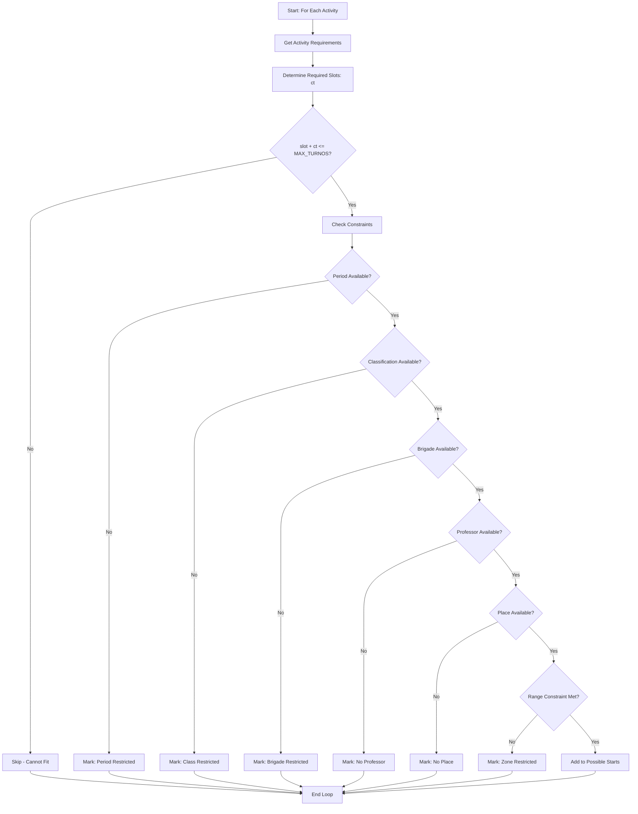
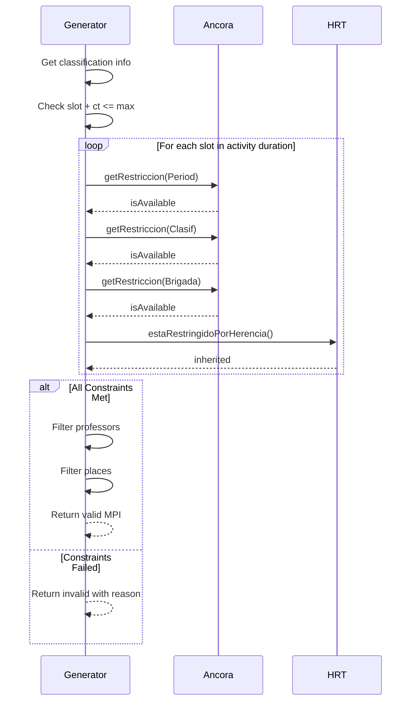
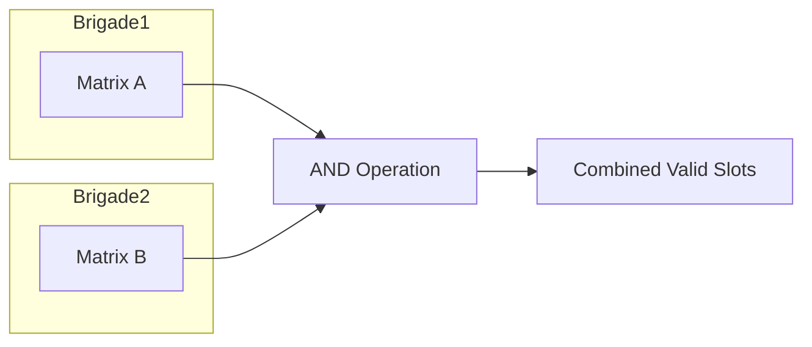

# MPI Algorithm Documentation

## Overview

The **Matriz de Posibles Inicios (MPI)** is the core algorithm in Áncora for determining valid starting positions for activities in the schedule.

---

## Algorithm Description



---

## Constraint Types

### 1. Period Constraints
```vb
' Check if period allows activity
Period.rest(day, slot) = False ' Available
```

### 2. Classification Constraints
```vb
' Activity type restrictions
Clasif(idClasif).rest(day, slot) = False
```

### 3. Brigade Constraints
```vb
' Student availability
Brigada(idBrig).rest(day, slot) = False
```

### 4. Professor Constraints
```vb
' Teacher availability
Profe(idProfe).rest(day, slot) = False
```

### 5. Place Constraints
```vb
' Room availability
Lugar(idLugar).rest(day, slot) = False
```

### 6. Zone Priority (ZPriori)
```vb
' Preferred time zones
Clasif(idClasif).zpriori(day, slot) >= threshold
```

---

## Data Structures

### TMPI_Casilla
```vb
Type TMPI_Casilla
    valor As Boolean        ' Is this a valid start?
    lug As TFiltro         ' Available places
    prof As TFiltro        ' Available professors
    motivo As Long         ' Reason if invalid (0=ok)
End Type
```

### TMPI1
```vb
Type TMPI1
    MPI(1 To MAX_DIAS, 1 To MAX_TURNOS) As TMPI_Casilla
    ct As Long             ' Consecutive slots needed
End Type
```

---

## Core Functions

### PosibleInicio



### AND_MPI

Combines MPI matrices for multiple brigades (logical AND):

```vb
' For multiple brigades doing the same activity
For each brigade
    MPI_combined = MPI_combined AND MPI_brigade
Next
```



### OR_MPI

Combines multiple schedule options (logical OR):

```vb
' Combine multiple professor options
For each professor
    MPI_combined = MPI_combined OR MPI_professor
Next
```

---

## Heuristic Optimization

### Place Selection Priority

1. **Same as before**: Prefer same room used earlier
2. **Least used**: Choose least restricted room
3. **Distance**: Minimize travel between rooms

```vb
Function SelectLugarOptimo(...)
    ' Check if place used earlier today
    If SamePlaceAvailable Then
        Return SamePlace
    End If
    
    ' Check proximity
    If NearPlaceAvailable Then
        Return NearPlace
    End If
    
    ' Fall back to least used
    Return LeastRestrictedPlace
End Function
```

### Professor Selection Priority

1. **Already assigned to group**
2. **Available for entire duration**
3. **Minimum scheduling conflicts**

---

## Performance Considerations

### Caching
- MPI calculated on-demand, cached until data changes
- HRT constraints pre-computed per entity

### Optimization
- Early exit on first conflict
- Batch constraint checking
- Incremental updates when adding single assignment

---

## Edge Cases

| Case | Handling |
|------|----------|
| No valid slots | Activity marked as impossible |
| Multiple valid slots | Heuristics determine best choice |
| All professors busy | Include in rejection reason |
| Room capacity exceeded | Filtered from place options |
| Overlapping activities | Tracked in assignments |

---

## Future Improvements

1. **Backtracking**: Explore alternative schedules when stuck
2. **Genetic Algorithm**: Global optimization of entire schedule
3. **Parallel Processing**: Multi-threaded constraint checking
4. **Machine Learning**: Learn optimal heuristics from past schedules

---

*Document Status: ⏳ Planned*
