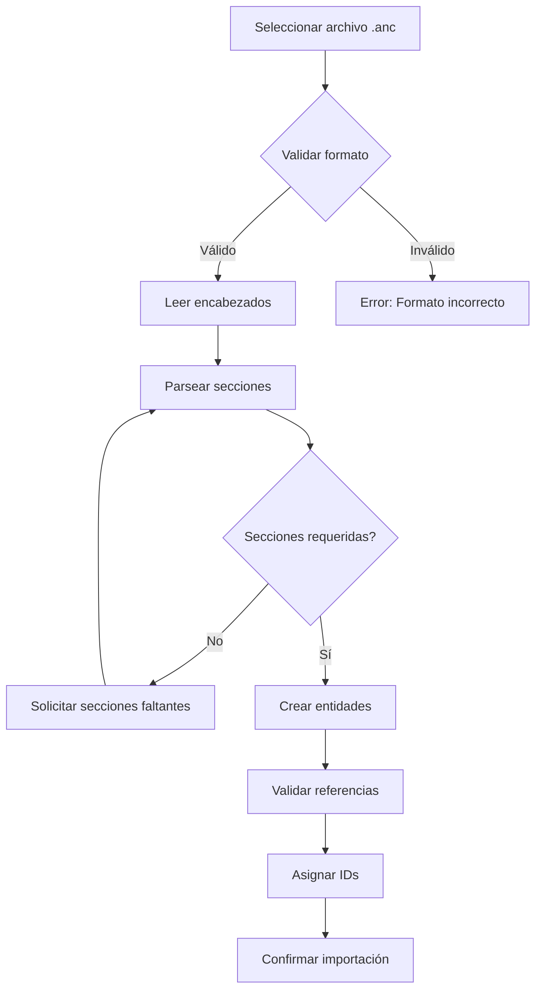
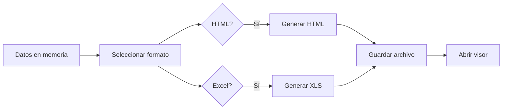

# Data Exchange Protocols

> Import/export formats and data interchange specifications.

## Supported Formats

| Format | Extension | Direction | Status |
|--------|-----------|-----------|--------|
| Áncora Native | `.anc` | Import/Export | ✅ Primary |
| HTML | `.html` | Export Only | ✅ Supported |
| Excel | `.xls` | Export Only | ✅ Via libExcel |
| CSV | `.csv` | Import/Export | ⏳ Planned |

---

## .anc File Format

Plain-text format with section-based structure.

### File Structure

```
[ENCABEZADO]
app_name=Áncora
version=1.2.0
fecha=2024-01-15

[PERIODOS]
periodo,iddesplegable,descripcion
2024-1,2024-1,Primer Cuatrimestre 2024

[ESPECIALIDADES]
idesp,descrip,horasbloque
info,Ingeniería Informática,5
civil,Ingeniería Civil,4

[BRIGADAS]
idbrigada,idesp,nivel,matricula,descrip
1A,info,1,30,Primer Año A
1B,info,1,28,Primer Año B
```

### Section Reference

| Section | Content | Required |
|---------|---------|----------|
| `ENCABEZADO` | File metadata | Yes |
| `PERIODOS` | Time periods | Yes |
| `ESPECIALIDADES` | Academic programs | Yes |
| `BRIGADAS` | Student groups | Yes |
| `ASIGNATURAS` | Subjects/courses | Yes |
| `CLASIFICACIONES` | Activity types | Yes |
| `PROFESORES` | Instructors | Yes |
| `LUGARES` | Classrooms | Yes |
| `RECURSOS` | Equipment | No |
| `RESTRICCIONES` | Time restrictions | No |
| `ASIGNACIONES` | Scheduled activities | No |

---

## Import Process



### Validation Rules

1. **Section presence**: Required sections must exist
2. **Field count**: Each row must have correct number of fields
3. **ID uniqueness**: No duplicate IDs within entity type
4. **Reference integrity**: Foreign keys must exist
5. **Value ranges**: Numeric fields within limits

---

## Export Process



---

## HTML Export

Generates static HTML files viewable in any browser.

### Output Structure

```
export/
├── index.html           # Main navigation
├── 1A.html             # Brigade 1A schedule
├── 1B.html             # Brigade 1B schedule
├── profes.html         # Professor view
└── lugares.html        # Room view
```

### HTML Template

```html
<!DOCTYPE html>
<html>
<head>
    <title>Horario - {brigada}</title>
    <meta charset="UTF-8">
    <style>
        table.schedule { border-collapse: collapse; }
        td { border: 1px solid #ccc; padding: 8px; }
        .theory { background: #e3f2fd; }
        .lab { background: #f3e5f5; }
        .practice { background: #fff3e0; }
    </style>
</head>
<body>
    <h1>Horario {brigada}</h1>
    <table class="schedule">
        <!-- Generated rows -->
    </table>
</body>
</html>
```

---

## Excel Export

Uses `libExcel.cls` for generation.

### Workbook Structure

| Sheet | Content |
|-------|---------|
| Resumen | Overview statistics |
| Brigadas | Brigade schedules |
| Profesores | Professor schedules |
| Lugares | Room utilization |

### Column Mapping

| Column | Content |
|--------|---------|
| A | Día |
| B | Turno |
| C | Hora |
| D | Asignatura |
| E | Profesor |
| F | Lugar |
| G | Grupo |
| H | Tipo (Clasificación) |

---

## Data Mapping

### Entity Translations

| Spanish | English | .anc Field |
|---------|---------|-----------|
| Período | Period | `periodo` |
| Especialidad | Specialty | `idesp` |
| Brigada | Brigade | `idbrigada` |
| Asignatura | Subject | `idasig` |
| Clasificación | Classification | `idclasif` |
| Profesor | Professor | `idprofe` |
| Lugar | Place | `idlugar` |
| Recurso | Resource | `idrecurso` |

---

## CSV Import/Export (Future)

Planned for bulk data operations.

### CSV Format

```csv
entity_type,id,field1,field2,field3
PERIODO,2024-1,2024-1,Primer Cuatrimestre,
ESPECIALIDAD,info,Ingeniería Informática,,
BRIGADA,1A,info,1,30
```

### Batch Operations

- Bulk import of entities
- Update existing records
- Delete by ID list

---

## Error Handling

| Error Code | Meaning | Action |
|------------|---------|--------|
| `E001` | File not found | Prompt for valid path |
| `E002` | Invalid format | Show format help |
| `E003` | Missing section | List missing sections |
| `E004` | Duplicate ID | Highlight duplicates |
| `E005` | Invalid reference | Show reference chain |
| `E006` | Read error | Retry or skip |

---

## Related Documentation

- [File Format Specification](../04-protocolos/file-format.md) - Detailed .anc format
- [Data Structures](../03-especificacion/data-structures.md) - UDT definitions

---

*Last Updated: 2026-04-06*
*Status: ⏳ CSV support planned*
