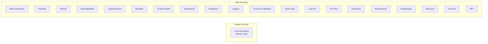

# File Format Specification (.anc)

## Overview

The `.anc` file format is a plain-text, section-based format for storing schedule data. It was designed for:
- Human readability
- Easy backup/version control
- Simple parsing

---

## File Structure



---

## Section Reference

### Header

```anc
; ------------------------------------------------------------------------------------------
;            Áncora, generación y organización de horarios Ver 1.2.0
;                          Archivo de horarios
;
;                    ¿Cuándo se guardó este archivo?
;                           Fecha: 4/3/2026
;                           Hora: 6:39:55 PM
; ------------------------------------------------------------------------------------------
```

### Datos Generales

```anc
; ; ; ; ; ; ; ; ; ; ; ; ; ; ; ; ; ; ; ; ; ; ; ; ; ; ; ; ; ;
;              DATOS GENERLES
; ; ; ; ; ; ; ; ; ; ; ; ; ; ; ; ; ; ; ; ; ; ; ; ; ; ; ; ;
5               ; Cantidad de días (CD)
5               ; Cantidad de turnos por día (CT)
```

### Periodos

```anc
; ; ; ; ; ; ; ; ; ; ; ; ; ; ; ; ; ; ; ; ; ; ; ; ; ; ; ; ;
;              PERIODOS
; ; ; ; ; ; ; ; ; ; ; ; ; ; ; ; ; ; ; ; ; ; ; ; ; ; ; ; ;
2               ; Cantidad de periodos

si,,,si,         ; ID, descripción, caption, template, expand flag
0,0,0,0,0,       ; Restrictions matrix row 1 (for day 1)
0,0,0,0,0,       ; Restrictions matrix row 2 (for day 2)
...

sp,,,sp,         ; Periodo "sp" (siesta/afternoon?)
0,0,0,0,0,
...
```

**Period Format:**
```
ID,Descripcion,Caption,Template,Flag
Matrix of (MAX_DIAS × MAX_TURNOS) restrictions
```

### Especialidades

```anc
; ; ; ; ; ; ; ; ; ; ; ; ; ; ; ; ; ; ; ; ; ; ; ; ; ; ; ; ;
;              ESPECIALIDADES
; ; ; ; ; ; ; ; ; ; ; ; ; ; ; ; ; ; ; ; ; ; ; ; ; ; ; ; ;
1               ; Cantidad

info,info,info, ; ID, descripción, ID (repeated)
si               ; Flag
0,0,0,0,0,      ; Restrictions matrix
...
```

### Clasificaciones

```anc
; ; ; ; ; ; ; ; ; ; ; ; ; ; ; ; ; ; ; ; ; ; ; ; ; ; ; ; ;
;              CLASIFICACION DE ACTIVIDADES
; ; ; ; ; ; ; ; ; ; ; ; ; ; ; ; ; ; ; ; ; ; ; ; ; ; ; ; ;
2               ; Cantidad

conf,, 1 ,conf, ; ID, descripción, CT (consecutive slots), ID
si               ; Flag: continuos
0,0,0,0,0,      ; Restricciones matrix
...
sp               ; Section delimiter
1,1,1,1,1,      ; ZPriori matrix (zone priorities)
...

cp,clase practica, 1 ,cp,
si
...
```

### Brigadas

```anc
; ; ; ; ; ; ; ; ; ; ; ; ; ; ; ; ; ; ; ; ; ; ; ; ; ; ; ; ;
;              BRIGADAS
; ; ; ; ; ; ; ; ; ; ; ; ; ; ; ; ; ; ; ; ; ; ; ; ; ; ; ; ;
1               ; Cantidad

b1,b1,info, 1 , 0 , 0 ,b1,  ; ID, descrip, esp, nivel, flag, ?, flag, ID
si               ; Flag
0,0,0,0,0,
...
```

**Format:** `ID,Descrip,Especialidad,Nivel,Flag1,Flag2,Flag3,ID`

### Grupos×Clasificación

```anc
; ; ; ; ; ; ; ; ; ; ; ; ; ; ; ; ; ; ; ; ; ; ; ; ; ; ; ; ;
;   GRUPOS POR CLASIFICACION DE ACTIVIDADES
; ; ; ; ; ; ; ; ; ; ; ; ; ; ; ; ; ; ; ; ; ; ; ; ; ; ; ; ;
b1,1,2,        ; BrigadaID, Nivel, Grupo
```

### Asignaturas

```anc
; ; ; ; ; ; ; ; ; ; ; ; ; ; ; ; ; ; ; ; ; ; ; ; ; ; ; ; ;
;              ASIGNATURAS
; ; ; ; ; ; ; ; ; ; ; ; ; ; ; ; ; ; ; ; ; ; ; ; ; ; ; ; ;
1               ; Cantidad

mat,,info,1,,   ; ID, descrip, especialidad, nivel, examenes
si               ; Flag
0,0,0,0,0,
...
si,1,0,1,2,2,conf,cp,  ; Desglose: flag, min, max, respectOrder, mismodia, ?, clasif1, clasif2
sp,1,0,1,2,0,          ; Período "sp": flag, min, max, respectOrder, mismodia
```

### Profesores

```anc
; ; ; ; ; ; ; ; ; ; ; ; ; ; ; ; ; ; ; ; ; ; ; ; ; ; ; ; ;
;              PROFESORES
; ; ; ; ; ; ; ; ; ; ; ; ; ; ; ; ; ; ; ; ; ; ; ; ; ; ; ; ;
1               ; Cantidad

p1,,0,p1,       ; ID, descrip, flag, ID
si
0,0,0,0,0,
...
```

### Lugares

```anc
; ; ; ; ; ; ; ; ; ; ; ; ; ; ; ; ; ; ; ; ; ; ; ; ; ; ; ; ;
;              LUGARES
; ; ; ; ; ; ; ; ; ; ; ; ; ; ; ; ; ; ; ; ; ; ; ; ; ; ; ; ;
1               ; Cantidad

a1,,0,0,0,0,0,0,0 ; ID, descrip, flags..., capacidad
si
0,0,0,0,0,
...
```

### Profesores×Actividad

```anc
; ; ; ; ; ; ; ; ; ; ; ; ; ; ; ; ; ; ; ; ; ; ; ; ; ; ; ; ;
;              PROFESORES POR ACTIVIDAD
; ; ; ; ; ; ; ; ; ; ; ; ; ; ; ; ; ; ; ; ; ; ; ; ; ; ; ; ;
2               ; Cantidad

mat,si,1,p1,1,1, ; Asignatura, flag, act#, profesor, flags
mat,si,2,p1,1,2,
```

**Format:** `Asignatura,Flag,Actividad#,Profesor,Prioridad,Grupo`

### Asignaciones

```anc
; ; ; ; ; ; ; ; ; ; ; ; ; ; ; ; ; ; ; ; ; ; ; ; ; ; ; ; ;
;          ASIGNACIONES DE ACTIVIDADES
; ; ; ; ; ; ; ; ; ; ; ; ; ; ; ; ; ; ; ; ; ; ; ; ; ; ; ; ;
0               ; Cantidad (0 = none)
```

### Actividades Rechazadas

```anc
; ; ; ; ; ; ; ; ; ; ; ; ; ; ; ; ; ; ; ; ; ; ; ; ; ; ; ; ;
;              ACTIVIDADES RECHAZADAS
; ; ; ; ; ; ; ; ; ; ; ; ; ; ; ; ; ; ; ; ; ; ; ; ; ; ; ; ;
2               ; Cantidad

4/3/2026,4:36:23,mat,si, 1 ,,b1, 25 , 0 , 0 , 25
4/3/2026,4:36:23,mat,si, 2 ,,b1, 25 , 0 , 0 , 25
```

**Format:** `Fecha,Hora,Asignatura,Flag,Actividad#,?,Brigada,Attempts,?,?,?`

---

## Data Type Mapping

| Section | Internal Type | Structure |
|---------|--------------|-----------|
| Periodos | `TPeriodo` | Collection |
| Especialidades | `Especialidad()` | Array of `TRecurso` |
| Brigadas | `Brigada()` | Array of `TBrigada` |
| Asignaturas | `asig()` | Array of `TAsig` |
| Clasificaciones | `clasif()` | Array of `TClasif` |
| Profesores | `profe()` | Array of `TRecurso` |
| Lugares | `lugar()` | Array of `TRecurso` |
| Asignaciones | `Asignaciones()` | Array of `TActAsignada` |
| Recursos | `recursos` | Collection |

---

## Parsing Rules

1. Lines starting with `;` are comments
2. Section headers are comments with `;;;;` pattern
3. Values separated by commas
4. Trailing spaces significant for IDs
5. Numeric values use `Val()` conversion

---

## Extension Possibilities

1. **Binary format** for performance
2. **Compressed format** for large datasets
3. **XML/JSON alternative** for interoperability
4. **Database backend** for multi-user

---

*Document Status: 🔄 In Progress*
