# Mermaid Diagram Examples

This file contains Mermaid diagrams used throughout the documentation.

---

## Entity Relationship Diagrams

### Basic ER
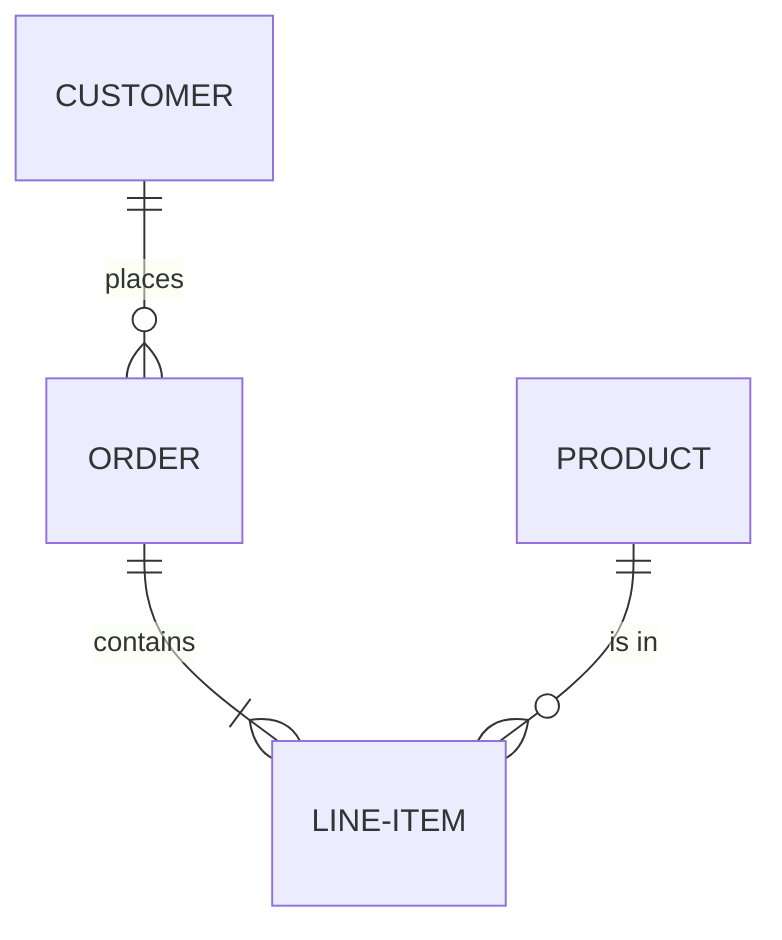

### Áncora Entities
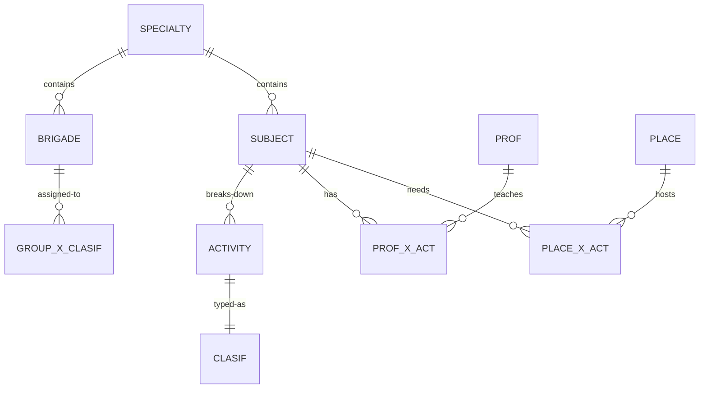

---

## Flowcharts

### Process Flow
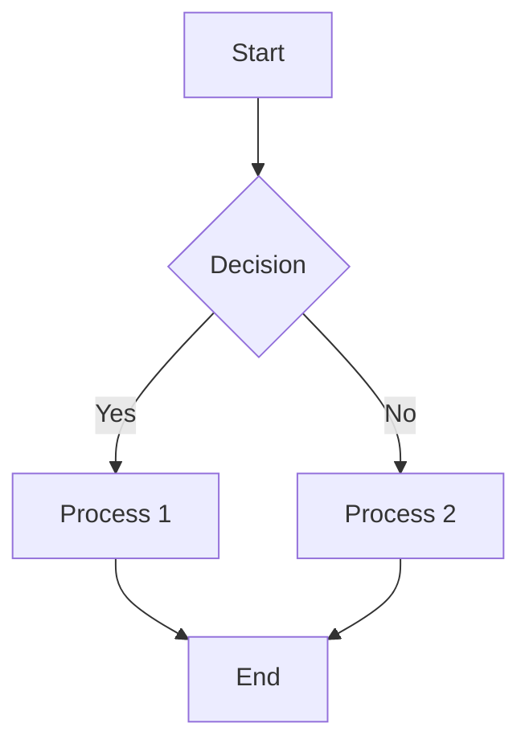

### Data Flow
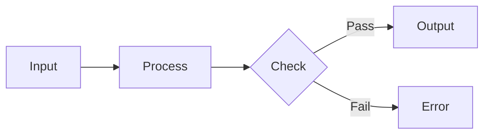

---

## Sequence Diagrams

### Simple Sequence
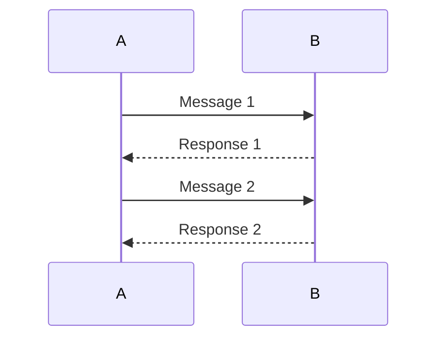

### With Decision
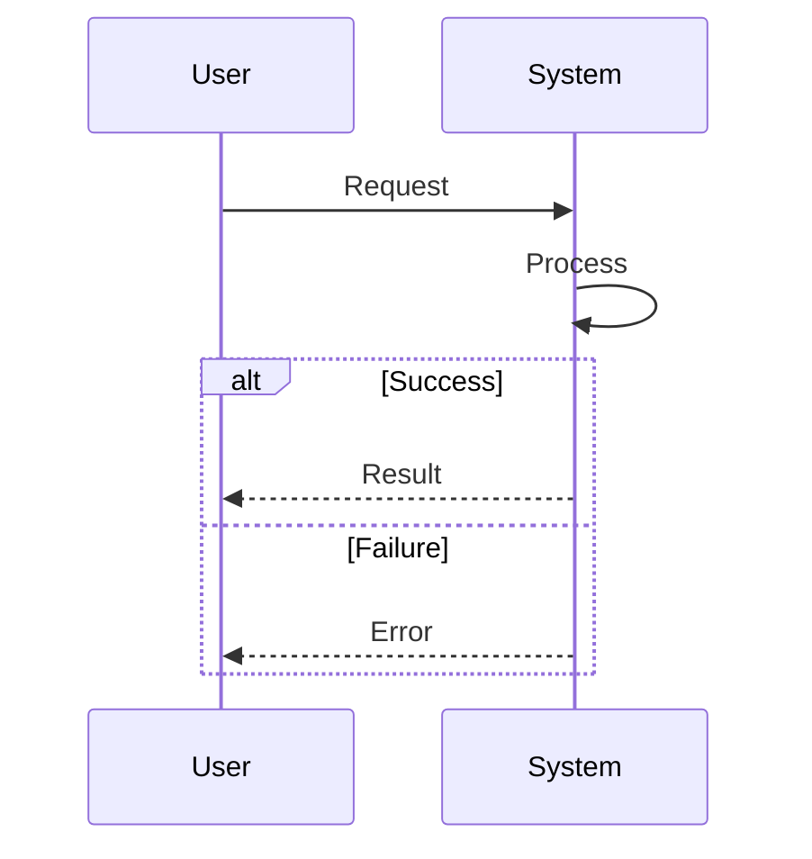

---

## Class Diagrams

### Basic Class
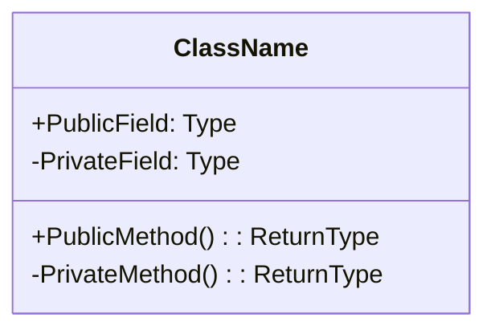

### Class Relationships
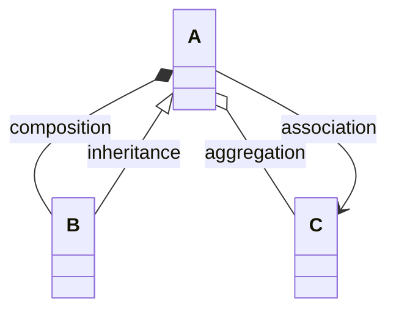

---

## State Diagrams

### Simple State
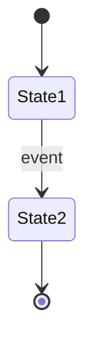

---

## Pie Charts

### Distribution
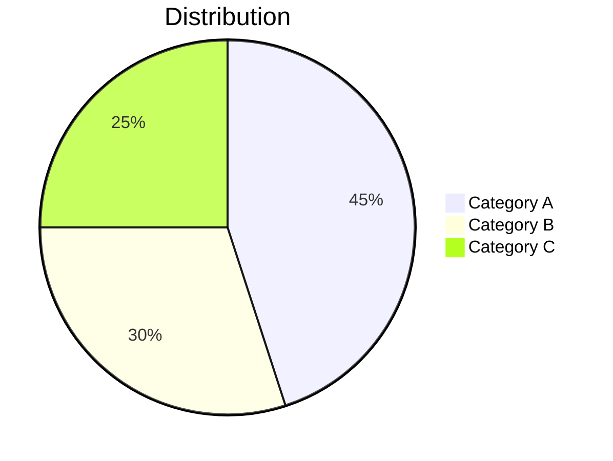

---

## Gantt Charts

### Timeline
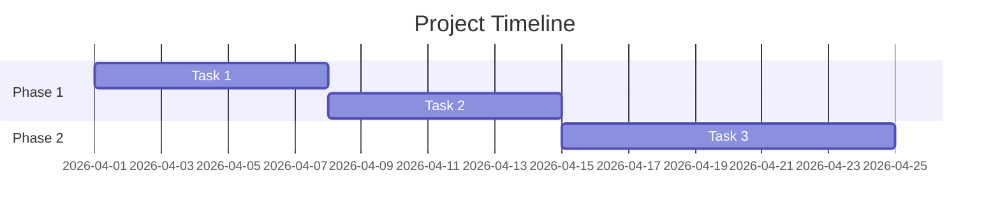

---

## Mind Maps

### Concept Map
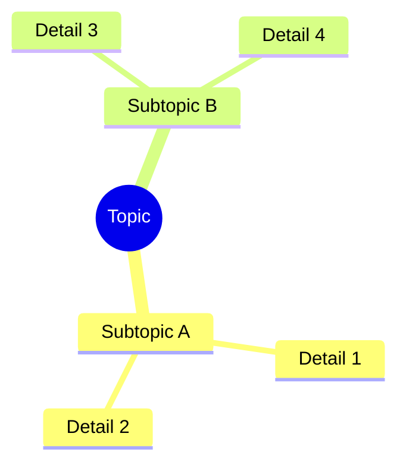

---

## Git Graph

### Branch Example
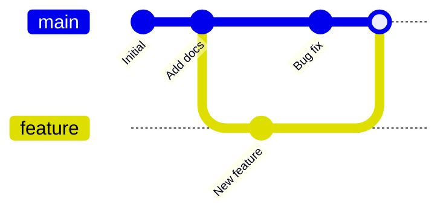

---

## User Journey

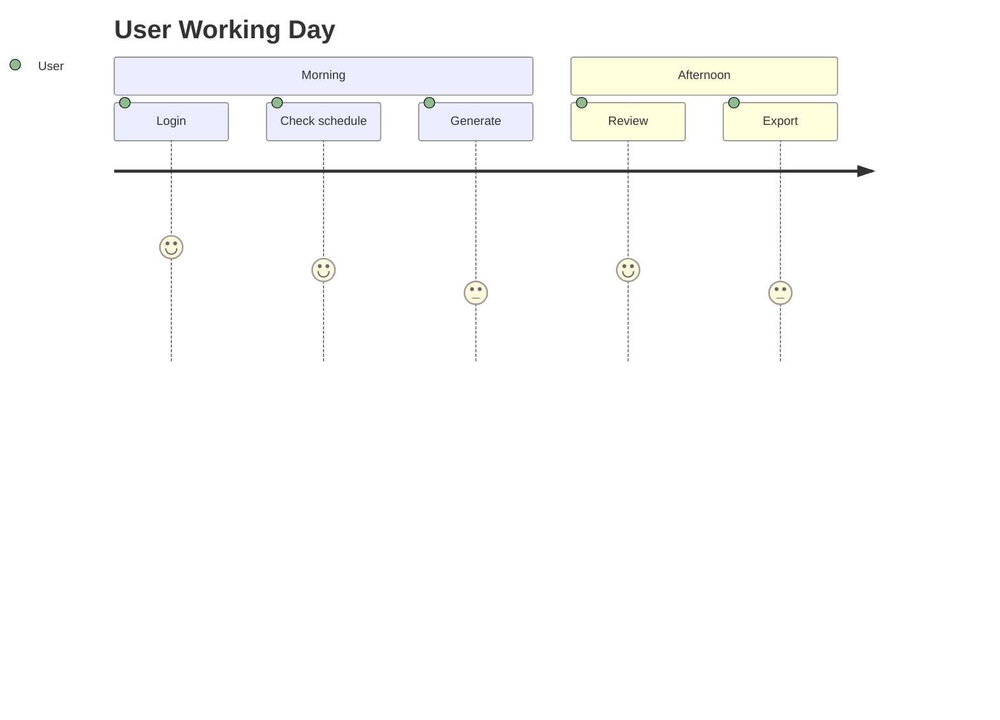

---

*This file is a reference for Mermaid syntax used in the documentation.*
