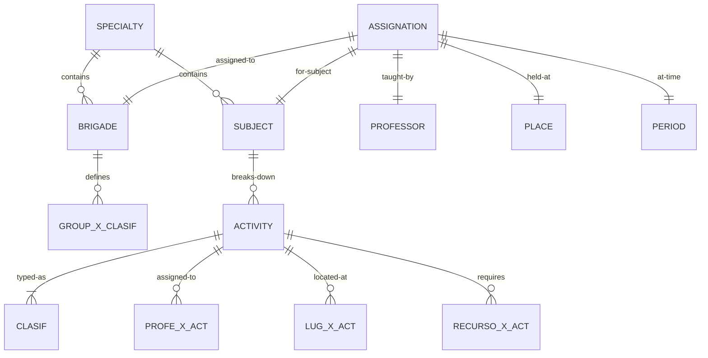
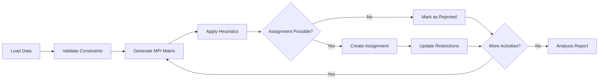

# Áncora - Technical Documentation Vault

> This folder contains comprehensive technical documentation for the Áncora scheduling system.
> Designed as an Obsidian-compatible knowledge base using RUP methodology and UML.

## Index

### 📐 01. Modeling (Modelado)
| Phase | Description | Status |
|-------|-------------|--------|
| [01-Contexto](./01-modelado/01-contexto/) | Context View | 🔄 In Progress |
| [02-Negocio](./01-modelado/02-negocio/) | Business View | 🔄 In Progress |
| [03-Logico](./01-modelado/03-logico/) | Logical View | 🔄 In Progress |
| [04-Fisico](./01-modelado/04-fisico/) | Physical View | 🔄 In Progress |

### 🏗️ 02. Architecture (Arquitectura)
- [System Architecture](./02-arquitectura/)
- [Component Diagram](./02-arquitectura/component-diagram.md)
- [Package Structure](./02-arquitectura/package-structure.md)

### 📋 03. Specifications (Especificación)
- [Core Modules](./03-especificacion/)
- [Data Structures](./03-especificacion/data-structures.md)

### 📖 04. Protocols (Protocolos)
- [File Format (.anc)](./04-protocolos/file-format.md)

### 📚 05. Glossary (Glosario)
- [Terminology](./05-glosario/terminology.md)

---

## Quick Reference

### Entity Relationship

### Core System Flow

---

## Documentation Conventions

### Naming Patterns
| Current (Spanish) | Future (English) | Type |
|-------------------|------------------|------|
| `cantAsignaciones` | `AssignmentCount` | Variable |
| `getCantBrg()` | `GetBrigadeCount()` | Function |
| `deleteProfe()` | `DeleteProfessor()` | Method |
| `insertLxAct_lug` | `InsertLocationForActivity` | Method |

### Color Coding
- 🟢 Complete
- 🔄 In Progress  
- ⏳ Planned
- ❌ Blocked

---

*Last Updated: 2026-04-05*
*Maintained by: Project Contributors*
