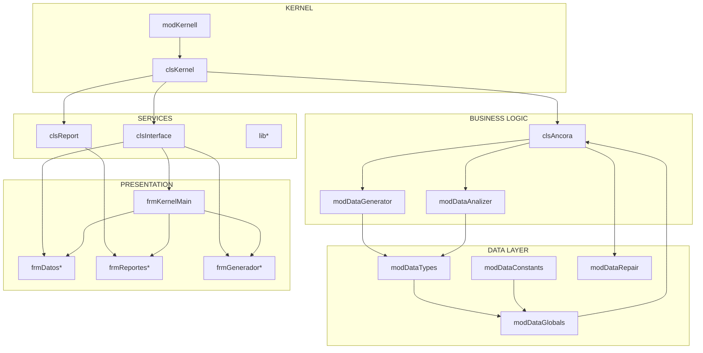

# ETAPA 1: Arqueología del Sistema

> **Objetivo**: Inventariar, mapear y entender el sistema completo antes de tocarlo  
> **Riesgo**: Muy bajo (solo lectura y documentación)  
> **Entregable**: Mapa completo del sistema

---

## 1.1 Inventario de Archivos

### Estructura Actual

```
ancora-vb6/
├── bas/                          # 12 módulos estándar
│   ├── modDataTypes.bas                  # Tipos (UDTs)
│   ├── modDataTypesExtension.bas         # Extensiones de tipos
│   ├── modDataTypesExtension_1.bas
│   ├── modDataTypesExtension_2.bas
│   ├── modDataTypesTools.bas           # Herramientas de tipos
│   ├── modDataConstants.bas            # Constantes
│   ├── modDataGlobals.bas             # Variables globales
│   ├── modDataGlobalsExtension.bas     # Extensiones globales
│   ├── modKernell.bas                 # Punto de entrada
│   ├── modDataGenerator.bas            # Algoritmo MPI
│   ├── modDataAnalizer.bas            # Análisis
│   ├── modDataRepair.bas              # Reparación
│   └── atareas.bas                    # TODO histórico
│
├── cls/                            # 42+ clases
│   ├── clsKernel.cls                  # Controlador kernel
│   ├── clsAncora.cls                  # Controlador datos
│   ├── clsInterface.cls                # Coordinación UI
│   ├── clsReport.cls                  # Reportes
│   ├── TAncora.cls                   # Alias/duplicado
│   │
│   ├── TGOH_*.cls                   # ~15 clases recursos/HRT
│   │   ├── TGOH_HRT.cls
│   │   ├── TGOH_Recurso.cls
│   │   ├── TGOH_RecursoXAct.cls
│   │   ├── TGOH_arrRecurso.cls
│   │   ├── TGOH_arrHRT.cls
│   │   ├── TGOH_Restriccion.cls
│   │   ├── TGOH_GroupRest.cls
│   │   └── [más...]
│   │
│   ├── TKernel_*.cls                 # ~10 clases infraestructura
│   │   ├── TKernel_Hash.cls
│   │   ├── TKernel_HashCollection.cls
│   │   ├── TKernel_HashPxAct.cls
│   │   ├── TKernel_ProcesoEnCola.cls
│   │   └── [más...]
│   │
│   ├── TAna_*.cls                    # ~8 clases análisis
│   │   ├── TAna_Optimo.cls
│   │   ├── TAna_OptimoAct.cls
│   │   ├── TAna_Recursos.cls
│   │   └── [más...]
│   │
│   ├── TAtom_*.cls                  # Utilidades atómicas
│   │   ├── TAtom_Variant.cls
│   │   ├── TAtom_matrixVariant.cls
│   │   └── [más...]
│   │
│   ├── TPeriodo.cls
│   ├── TRowRest.cls
│   ├── TCellRest.cls
│   ├── TarrCellRest.cls
│   ├── TarrRowRest.cls
│   ├── TarrPeriodo.cls
│   ├── TIdent.cls
│   ├── TCacheID.cls
│   ├── TPrioriza.cls
│   └── TConsole.cls
│
├── frm/                            # 50+ formularios
│   ├── frmKernel*.frm               # Kernel (Main, Bienvenido, MensajeEstado, About)
│   ├── frmDatos*.frm               # CRUD entidades
│   │   ├── frmDatosActividad.frm
│   │   ├── frmDatosBrigadas.frm
│   │   ├── frmDatosDesgloseAct.frm
│   │   ├── frmDatosDistancias.frm
│   │   ├── frmDatosGenerales.frm
│   │   ├── frmDatosGoMPI.frm
│   │   ├── frmDatosGrupos.frm
│   │   ├── frmDatosHRT.frm
│   │   ├── frmDatosLinkedObjects.frm
│   │   ├── frmDatosNiveles.frm
│   │   ├── frmDatosObjects.frm
│   │   ├── frmDatosOpcionesAct.frm
│   │   ├── frmDatosRecursos.frm
│   │   ├── frmDatosRestricc.frm
│   │   ├── frmDatosZpriori.frm
│   │   ├── frmDatosAnnos.frm
│   │   ├── frmDatosCambioProfeLugar.frm
│   │   ├── frmDatosAsignacionRxAct.frm
│   │   ├── frmDatosAutoRestricc.frm
│   │   └── frmDatosActividadesSinAsignar.frm
│   │
│   ├── frmReportes*.frm             # Reportes
│   │   ├── frmReportesAnalizaHorario.frm
│   │   ├── frmReportesAnalizaRecursos.frm
│   │   ├── frmReportesAnalizaRestricciones.frm
│   │   ├── frmReportesAsignaciones.frm
│   │   ├── frmReportesCreaModelos.frm
│   │   ├── frmReportesEstadisticas.frm
│   │   ├── frmReportesGrafico.frm
│   │   ├── frmReportesHuecosComunes.frm
│   │   ├── frmReportesImprimir.frm
│   │   ├── frmReportesResumenHuecos.frm
│   │   └── frmReportesResumenRestricc.frm
│   │
│   ├── frmGenerador*.frm            # Generación
│   │   ├── frmGeneradorGenerar.frm
│   │   └── frmGeneradorOpinion.frm
│   │
│   ├── frmHerramientas*.frm         # Herramientas
│   │   ├── frmHerramientasDuplicar.frm
│   │   └── frmHerramientasRedistribuir.frm
│   │
│   ├── frm_generic_*.frm           # Genéricos
│   │   ├── frm_generic_msgbox.frm
│   │   ├── frm_generic_inputbox.frm
│   │   ├── frm_generic_listview.frm
│   │   └── frm_generic_flexgrid.frm
│   │
│   ├── frmKernelAssistant.frm       # Asistente
│   ├── frmReportesPublicarHTML.frm  # Publicación HTML
│   ├── frmMostrarEnHorarios.frm
│   ├── frmMiniHorario.frm
│   ├── frmList.frm
│   ├── frmSplash.frm
│   ├── frm_Components.frm
│   └── frmPropiedades.frm
│
├── ctl/                            # Controles de usuario
│   ├── Ribbon.ctl                   # Ribbon menu (Office-style)
│   ├── casillero.ctl                # Celda de horario
│   └── XPButton.ctl                 # Botón estilizado
│
├── lib/                            # Librerías
│   ├── libUtils.cls                 # Utilidades
│   ├── libStrings.cls               # Strings
│   ├── libFiles.cls                 # Archivos
│   └── libExcelSheets.cls           # Excel
│
├── res/                            # Recursos
│   └── Themes.res
│
├── archivos_ejemplos/               # Datos de prueba
│   ├── arquitectura/
│   ├── civil/
│   ├── electrica/
│   ├── industrial/
│   ├── informatica/
│   ├── mecanica/
│   ├── quimica/
│   └── prueba.anc
│
├── docs/tecnica/                    # Documentación técnica
│
├── ayuda/                          # Sistema de ayuda
│
├── Installer/                      # Instalador
│
├── Ancora.vbp                      # Proyecto VB6
├── Ancora.vbw                      # Workspace VB6
├── Ancora.skn                      # Skin
├── ancora.cfg                      # Configuración
├── server.conf                    # Config servidor
└── registrar.bat                   # Registro de OCX
```

---

## 1.2 Inventario de Módulos

### Módulos Críticos

| Módulo | Líneas (est.) | Responsabilidad | Complejidad |
|--------|--------------|----------------|-------------|
| `modKernell` | ~400 | Punto de entrada, Main() | 🔴 Alta |
| `modDataGenerator` | ~2000 | Algoritmo MPI | 🔴 Alta |
| `clsAncora` | ~9000 | Controlador datos, CRUD | 🔴 Alta |
| `modDataGlobals` | ~500 | Estado global | 🔴 Alta |

### Módulos de Soporte

| Módulo | Responsabilidad | Complejidad |
|--------|----------------|-------------|
| `modDataTypes` | Definiciones UDT | 🟡 Media |
| `modDataConstants` | Constantes | 🟢 Baja |
| `modDataAnalizer` | Análisis horarios | 🟡 Media |
| `modDataRepair` | Reparación | 🟡 Media |
| `clsInterface` | Coordinación UI | 🟡 Media |
| `clsReport` | Reportes | 🟡 Media |

---

## 1.3 Inventario de Formularios

### Por Categoría

```
┌─────────────────────────────────────────────────────────────────┐
│                    CATEGORÍAS DE FORMULARIOS                    │
├─────────────────────────────────────────────────────────────────┤
│                                                                 │
│  KERNEL (4)                                                    │
│  ├── frmKernelMain        (Principal)                         │
│  ├── frmKernelBienvenido   (Bienvenida)                       │
│  ├── frmKernelMensajeEstado(Estado)                           │
│  └── frmKernelAbout        (Acerca de)                        │
│                                                                 │
│  DATOS (20+) - CRUD de entidades                              │
│  ├── frmDatosActividad                                      │
│  ├── frmDatosBrigadas                                       │
│  ├── frmDatosDesgloseAct                                    │
│  ├── frmDatosDistancias                                     │
│  ├── frmDatosGenerales                                      │
│  ├── frmDatosGoMPI                                          │
│  ├── frmDatosGrupos                                          │
│  ├── frmDatosHRT                                            │
│  ├── frmDatosNiveles                                        │
│  ├── frmDatosRecursos                                       │
│  ├── frmDatosZpriori                                        │
│  └── ...                                                     │
│                                                                 │
│  REPORTES (10+)                                               │
│  ├── frmReportesAnalizaHorario                              │
│  ├── frmReportesEstadisticas                                │
│  ├── frmReportesGrafico                                     │
│  ├── frmReportesImprimir                                    │
│  └── ...                                                     │
│                                                                 │
│  GENERACIÓN (2)                                               │
│  ├── frmGeneradorGenerar                                    │
│  └── frmGeneradorOpinion                                     │
│                                                                 │
│  HERRAMIENTAS (2)                                             │
│  ├── frmHerramientasDuplicar                                 │
│  └── frmHerramientasRedistribuir                             │
│                                                                 │
│  GENÉRICOS (4)                                                │
│  ├── frm_generic_msgbox                                     │
│  ├── frm_generic_inputbox                                   │
│  ├── frm_generic_listview                                    │
│  └── frm_generic_flexgrid                                    │
│                                                                 │
│  ASISTENTE (1)                                                │
│  └── frmKernelAssistant     (Wizard de 15 pasos)             │
│                                                                 │
└─────────────────────────────────────────────────────────────────┘
```

---

## 1.4 Inventario de Tipos (UDTs)

### Tipos de Entidad

```vb
'===============================================================================
' TIPOS DE ENTIDAD - ÁNCORA
'===============================================================================

'-------------------------------------------------------------------------------
' ENTIDADES PRINCIPALES
'-------------------------------------------------------------------------------

' Base común para recursos (profesores, lugares, especialidades)
Type TRecurso
    id As String
    descrip As String
    rest() As TRestriccion    ' Matriz de restricciones
    virtual As Boolean
    capacidad As Long
End Type

' Braga/Grupo de estudiantes
Type TBrigada
    comun As TRecurso
    idesp As String              ' Especialidad
    Nivel As Long                ' Año/grado
    cantGxClasif As Long
    GrupoXClasif() As TGxClasif ' Grupos por clasificación
    matricula As Long             ' Cantidad de estudiantes
End Type

' Asignatura/Materia
Type TAsig
    comun As TRecurso
    idesp As String
    Nivel As Long
    desglose() As TDesglose     ' Actividades por período
End Type

' Clasificación de actividad (teoría, lab, práctica)
Type TClasif
    comun As TRecurso
    ct As Long                   ' Slots consecutivos requeridos
    continuos As Boolean         ' Debe ser mismo día
    zpriori() As TZPriori       ' Prioridad por zona
End Type

' Período (semana impar/par)
Type TPeriodo
    id As String
    descrip As String
    Caption As String
    template As String
End Type

'-------------------------------------------------------------------------------
' ASIGNACIONES Y ACTIVIDADES
'-------------------------------------------------------------------------------

' Actividad desglosada de una asignatura
Type TActividad
    idclasif As String           ' Clasificación
    cantProfesNecesarios As Long
    cantLugaresNecesarios As Long
End Type

' Desglose de actividades por período
Type TDesglose
    act(1 To MAX_ACT) As TActividad
    idperiodo As String
    cantact As Long
    RespetarOrden As Boolean
    min As Byte
    max As Byte
    mismodia As Boolean
End Type

' ASIGNACIÓN: Actividad programada en horario
Type TActAsignada
    dia As Long
    turno As Long
    idprofe As String            ' Profesor
    idasig As String             ' Asignatura
    idact As Long                ' Índice actividad
    idlugar As String           ' Lugar/aula
    idperiodo As String         ' Período
    idbrigada As String          ' Braga
    fija As Boolean              ' Bloqueada
    fecha As String
    hora As String * 8
    recursos() As String         ' Recursos adicionales
    cantrecursos As Long
End Type

'-------------------------------------------------------------------------------
' RESTRICCIONES
'-------------------------------------------------------------------------------

' Matriz de restricciones
Type TRestriccion
    rest(1 To MAX_DIAS, 1 To MAX_TURNOS) As Boolean
    idperiodo As String
End Type

' Zona de prioridad
Type TZPriori
    idperiodo As String
    rest(1 To MAX_DIAS, 1 To MAX_TURNOS) As Byte
End Type

' Grupo por clasificación
Type TGxClasif
    idclasif As String
    grupo As Long
End Type

'-------------------------------------------------------------------------------
' REFERENCIAS CRUZADAS
'-------------------------------------------------------------------------------

' Referencia a asignatura/período/actividad
Type TAsignaRecurso
    idasig As String
    idper As String
    idact As Long
End Type

' Profesor × Actividad
Type TProfeXAct
    para As TAsignaRecurso
    idprofes As String
    cantGrupos As Long
    grupos() As Long
End Type

' Lugar × Actividad
Type TLugarXAct
    para As TAsignaRecurso
    cantLug As Long
    idlug() As String
    priori() As Long             ' Prioridad
End Type

'-------------------------------------------------------------------------------
' ANÁLISIS
'-------------------------------------------------------------------------------

' Información de actividad imposible
Type TImposible
    idasig As String
    idper As String
    idact As Long
    idbrigada As String
    fecha As String
    hora As String * 8
    RechazosXRest As Long
    RechazosXProf As Long
    RechazosXLug As Long
End Type

' Porcentaje de restricción
Type TPercentRestricc
    dato As Long
    id As Long
    idper As Long
    parte As Long
End Type

'-------------------------------------------------------------------------------
' AUXILIARES
'-------------------------------------------------------------------------------

' Filtro de elementos
Type TFiltro
    cant As Long
    id() As Long
End Type

' Rango de valores
Type TRango
    ini As Long
    fin As Long
End Type

' Distancias entre lugares
Type TColumDistancia
    id As String
    dist As Long
End Type

Type TFilaDistancia
    id As String
    colum() As TColumDistancia
End Type
```

---

## 1.5 Inventario de Variables Globales

```vb
'===============================================================================
' VARIABLES GLOBALES - ÁNCORA
'===============================================================================

'-------------------------------------------------------------------------------
' ENTIDADES PRINCIPALES (ARRAYS)
'-------------------------------------------------------------------------------
Public Especialidad() As TRecurso           ' Carreras/programas
Public Brigadier() As TBrigada             ' Grupos de estudiantes
Public asig() As TAsig                    ' Asignaturas/materias
Public clasif() As TClasif                ' Tipos de actividad
Public profe() As TRecurso               ' Profesores
Public lugar() As TRecurso                ' Lugares/aulas

'-------------------------------------------------------------------------------
' CONTADORES DE ENTIDADES
'-------------------------------------------------------------------------------
Public cantEsp As Long                     ' Cantidad especialidades
Public cantBrg As Long                   ' Cantidad brigadas
Public cantAsig As Long                   ' Cantidad asignaturas
Public cantClasif As Long                 ' Cantidad clasificaciones
Public cantProfe As Long                  ' Cantidad profesores
Public cantLug As Long                    ' Cantidad lugares
Public cantPxAct As Long                   ' Cantidad Profesor×Actividad
Public cantLxAct As Long                   ' Cantidad Lugar×Actividad

'-------------------------------------------------------------------------------
' ASIGNACIONES
'-------------------------------------------------------------------------------
Public Asignaciones() As TActAsignada     ' Actividades programadas
Public Imposibles() As TImposible         ' Actividades rechazadas
Public cantAsignaciones As Long
Public cantImposibles As Long

'-------------------------------------------------------------------------------
' REFERENCIAS CRUZADAS
'-------------------------------------------------------------------------------
Public LugXact() As TLugarXAct            ' Lugar × Actividad
Public ProfeXAct() As TProfeXAct          ' Profesor × Actividad

'-------------------------------------------------------------------------------
' RECURSOS Y HERRAMIENTAS
'-------------------------------------------------------------------------------
Public AulasFijas() As TAulaFija
Public Distancias() As TFilaDistancia
Public MUESTRA_EN_HORARIO(3) As TMuestraEnHorario
Public cacheID(dCantArreglos) As TCacheID

'-------------------------------------------------------------------------------
' CONTROLADORES (SINGLETON IMPLÍCITO)
'-------------------------------------------------------------------------------
Public ancora As clsAncora                ' Controlador datos
Public interface As clsInterface          ' Coordinación UI
Public kernel As clsKernel                ' Kernel
Public reports As clsReport               ' Reportes

'-------------------------------------------------------------------------------
' ESTADO DE APLICACIÓN
'-------------------------------------------------------------------------------
Public RutaArchivo As String              ' Archivo actual
Public GuardarAlSalir As Boolean         ' Guardar al cerrar
Public cantNiveles As Long               ' Cantidad de niveles
Public cantfijas As Long                 ' Asignaciones fijas

'-------------------------------------------------------------------------------
' CONSTANTES DE ESTADO
'-------------------------------------------------------------------------------
Public CD As Long                        ' Cantidad de días
Public ct As Long                        ' Turnos por día
Public dCantArreglos As Long            ' Dimensión de arreglos
```

---

## 1.6 Inventario de Constantes

```vb
'===============================================================================
' CONSTANTES DEL SISTEMA
'===============================================================================

'-------------------------------------------------------------------------------
' LÍMITES
'-------------------------------------------------------------------------------
Public Const MAX_DIAS As Long = 7          ' Días máximos
Public Const MAX_TURNOS As Long = 12     ' Slots por día
Public Const MAX_ACT As Long = 5           ' Actividades por período

'-------------------------------------------------------------------------------
' ÍNDICES DE ENTIDADES (para IndexById)
'-------------------------------------------------------------------------------
Public Const dCantArreglos = 9
Public Const dPERIODO = 1
Public Const dESPECIALIDAD = 2
Public Const dCLASIF = 3
Public Const dPROFE = 4
Public Const dLUGAR = 5
Public Const dBRIGADA = 6
Public Const dASIG = 7
Public Const dDESGLOSE = 8
Public Const dRECURSO = 9

'-------------------------------------------------------------------------------
' RUTAS
'-------------------------------------------------------------------------------
Public Const FILE_SERVER_CONF = "server.conf"

'-------------------------------------------------------------------------------
' CADENAS
'-------------------------------------------------------------------------------
Public Const CHARACTERS_STRING = "abcdefghijklmnopqrstuvwxyzABCDEFGHIJKLMNOPQRSTUVWXYZ"
Public Const CHARACTERS_INTEGER = "abcdefghijklmnopqrstuvwxyzABCDEFGHIJKLMNOPQRSTUVWXYZ"
```

---

## 1.7 Mapa de Dependencias



---

## 1.8 Flujos Críticos del Sistema

### Flujo 1: Carga de Datos

```
┌─────────────────────────────────────────────────────────────────┐
│ 1. CARGA DE DATOS (.anc)                                       │
├─────────────────────────────────────────────────────────────────┤
│                                                                 │
│ Main()                                                          │
│   └─► kernel.Ancora_Inicia()                                    │
│           └─► clsAncora.LeeTXT(ruta)                          │
│                   │                                             │
│                   ├─► Parseo archivo línea por línea           │
│                   │                                             │
│                   ├─► Carga Especialidades                     │
│                   ├─► Carga Brigadas                           │
│                   ├─► Carga Asignaturas                        │
│                   ├─► Carga Clasificaciones                    │
│                   ├─► Carga Profesores                        │
│                   ├─► Carga Lugares                           │
│                   ├─► Carga HRT (Herencia restricciones)       │
│                   │                                             │
│                   └─► Construir índices hash                    │
│                                                                 │
│ SALIDA: Arrays globales llenos, sistema listo                    │
└─────────────────────────────────────────────────────────────────┘
```

### Flujo 2: Generación de Horarios

```
┌─────────────────────────────────────────────────────────────────┐
│ 2. GENERACIÓN DE HORARIOS                                      │
├─────────────────────────────────────────────────────────────────┤
│                                                                 │
│ frmGeneradorGenerar.cmdGenerar_Click()                         │
│   └─► modDataGenerator.AsignaActividad()                        │
│           │                                                     │
│           ├─► Para cada Braga × Asignatura × Desglose:         │
│           │   │                                                 │
│           │   ├─► PosibleInicio() → MPI                        │
│           │   │       │                                        │
│           │   │       ├─► Check Período                        │
│           │   │       ├─► Check Clasificación                  │
│           │   │       ├─► Check Braga                         │
│           │   │       ├─► Check Profesor                       │
│           │   │       ├─► Check Lugar                         │
│           │   │       ├─► Check HRT                          │
│           │   │       └─► Check ZPriori                      │
│           │   │                                                 │
│           │   └─► Si MPI tiene slots válidos:                 │
│           │       └─► SelectLugarOptimo()                     │
│           │       └─► InsertAsignacionAct()                   │
│           │       └─► setNativeRestriccion()                  │
│           │                                                     │
│           └─► Si NO hay slots válidos:                        │
│               └─► CrearImposible()                            │
│                                                                 │
│ SALIDA: Asignaciones() + Imposibles()                          │
└─────────────────────────────────────────────────────────────────┘
```

### Flujo 3: Análisis

```
┌─────────────────────────────────────────────────────────────────┐
│ 3. ANÁLISIS DE HORARIOS                                      │
├─────────────────────────────────────────────────────────────────┤
│                                                                 │
│ modDataAnalizer.*                                              │
│   │                                                             │
│   ├─► DameHuecosComunes()                                    │
│   │       → Espacios libres comunes a todas las entidades      │
│   │                                                             │
│   ├─► PercentRestriccion()                                    │
│   │       → Porcentaje de restricciones por entidad           │
│   │                                                             │
│   ├─► getAnalisisRecursos()                                   │
│   │       → Utilización de recursos                           │
│   │                                                             │
│   └─► AnalisisOptimo                                          │
│           → Métricas de calidad del horario                   │
│                                                                 │
│ clsReport.*                                                    │
│   │                                                             │
│   ├─► CreateModel()                                           │
│   ├─► CreateHTMLSchedule()                                    │
│   └─► Publicar()                                              │
│                                                                 │
└─────────────────────────────────────────────────────────────────┘
```

---

## 1.9 Zonas de Complejidad y Riesgo

### 🔴 Zonas de Alto Riesgo - NO TOCAR (por ahora)

| Zona | Ubicación | Razón |
|------|-----------|--------|
| Algoritmo MPI | `modDataGenerator` | Crítico, cualquier cambio puede romper generación |
| Sistema HRT | `clsAncora` + `TGOH_*` | Complejo, poco documentado |
| Carga de archivos | `clsAncora.LeeTXT()` | Parseo frágil, cualquier cambio puede romper carga |
| Índices hash | `TKernel_Hash*` | Usado en todo, cambios pueden causar bugs sutiles |

### 🟡 Zonas de Riesgo Medio - Manejar con Cuidado

| Zona | Ubicación | Razón |
|------|-----------|--------|
| Asignaciones | `clsAncora.insertAsignacionAct()` | Afecta resultado final |
| Restricciones | `getRestriccion()` | Validación compleja |
| Sistema de reportes | `clsReport` | Muchos detalles de formato |

### 🟢 Zonas de Bajo Riesgo - Buenos Candidatos para Empezar

| Zona | Ubicación | Razón |
|------|-----------|--------|
| TODO histórico | `atareas.bas` | Solo comentarios |
| Constantes | `modDataConstants` | Valores puros |
| Utilidades | `lib*` | Independientes |
| Tipos | `modDataTypes` | Solo definiciones |

---

## 1.10 Preguntas de Arqueología

### Sobre Funcionalidad

- [ ] ¿El wizard de asistente (`frmKernelAssistant`) está completo?
- [ ] ¿Hay funcionalidad de base de datos que se usó en el pasado?
- [ ] ¿Los reportes HTML todavía funcionan?
- [ ] ¿Para qué sirven las "aulas fijas"?

### Sobre Arquitectura

- [ ] ¿Por qué hay dos sistemas de hashing (TKernel_Hash vs IndexById manual)?
- [ ] ¿Por qué existe `TAncora.cls` que parece duplicar `clsAncora.cls`?
- [ ] ¿Cuál es el propósito de `TPrioriza.cls`?

### Sobre Datos

- [ ] ¿Qué archivos de ejemplo están probados y funcionan?
- [ ] ¿Hay versiones intermedias guardadas?
- [ ] ¿El formato .anc está documentado completamente?

---

## 1.11 Tareas de la Etapa 1

### Tarea 1.1: Inventario Completo
- [x] Mapear estructura de carpetas
- [x] Listar todos los módulos
- [x] Listar todas las clases
- [x] Listar todos los formularios
- [ ] Verificar contadores reales

### Tarea 1.2: Análisis de Dependencias
- [ ] Mapear imports/exports de cada módulo
- [ ] Identificar quién llama a quién
- [ ] Identificar acoplamientos circulares

### Tarea 1.3: Análisis de Formularios
- [ ] Categorizar formularios por propósito
- [ ] Identificar formularios relacionados
- [ ] Documentar flujos de usuario

### Tarea 1.4: Análisis de Algoritmos
- [ ] Documentar algoritmo MPI paso a paso
- [ ] Documentar sistema HRT con ejemplos
- [ ] Mapear flujo de generación completo

### Tarea 1.5: Preguntas Abiertas
- [ ] Responder preguntas de la sección 1.10
- [ ] Entrevistar al autor original si es posible
- [ ] Buscar documentación histórica

---

## Criterios de Finalización - Etapa 1

- [ ] Inventario completo con métricas
- [ ] Mapa de dependencias actualizado
- [ ] Flujos críticos documentados
- [ ] Zonas de riesgo identificadas
- [ ] Preguntas de arqueología respondidas o marcadas
- [ ] Documento de arqueología completo en `docs/tecnica/`

---

## Siguiente Etapa

**[Etapa 2: Convenciones y Saneamiento](./ETAPA-02-convenciones.md)**

> Limpiar nomenclatura, comentarios y consistencia sin cambiar lógica.
